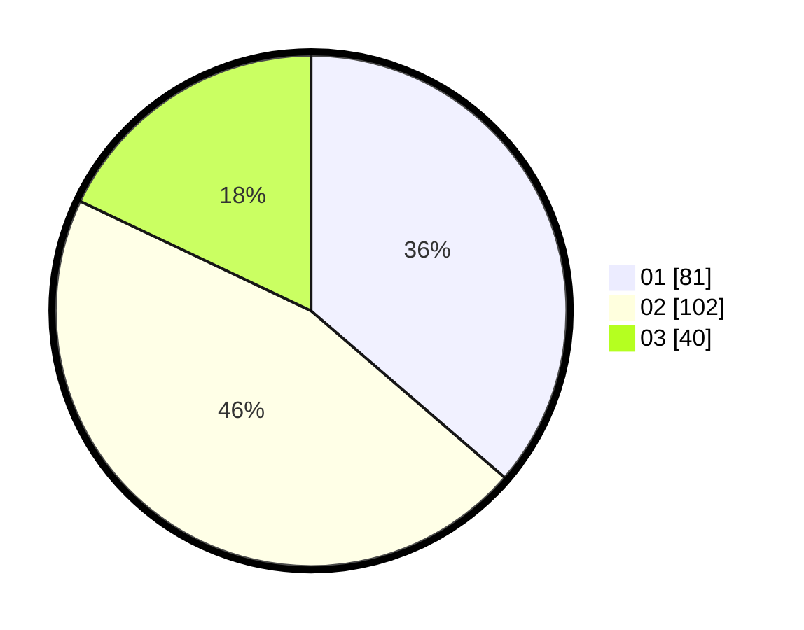

# Hasil

Hasil perolehan suara paslon dapat dilihat pada file paslon-01.txt, paslon-02.txt, dan paslon-03.txt.

Jika tidak ada, artinya data tersebut belum ada pada SIREKAP.

## Perolehan Suara

 * Paslon 01: **81**.
 * Paslon 02: **102**.
 * Paslon 03: **40**.

## Foto C Plano

https://sirekap-obj-formc.kpu.go.id/7bfd/pemilu/ppwp/31/73/05/10/06/3173051006124-20240216-184928--b4e3ba40-f333-471f-abdf-de194822feab.jpg

https://sirekap-obj-formc.kpu.go.id/7bfd/pemilu/ppwp/31/73/05/10/06/3173051006124-20240216-184930--0bbdfc7d-48aa-41bf-816d-507376f3e3f7.jpg

https://sirekap-obj-formc.kpu.go.id/7bfd/pemilu/ppwp/31/73/05/10/06/3173051006124-20240216-184929--9604bf6a-e401-44e2-abe1-6fb6b4cf335e.jpg

## DATA PEMILIH TETAP

Jumlah pemilih dalam DPT: **280**.
 * L: **136**.
 * P: **144**.

## DATA PENGGUNA HAK PILIH

Jumlah pengguna hak pilih dalam DPT: **215**.
 * L: **97**.
 * P: **118**.

Jumlah pengguna hak pilih dalam DPTb: **8**.
 * L: **0**.
 * P: **8**.

Jumlah pengguna hak pilih dalam DPK: **0**.
 * L: **1**.
 * P: **0**.

Jumlah pengguna hak pilih: **224**.
 * L: **98**.
 * P: **126**.

## JUMLAH SUARA SAH DAN TIDAK SAH

JUMLAH SELURUH SUARA SAH: **223**.

JUMLAH SUARA TIDAK SAH: **1**.

JUMLAH SELURUH SUARA SAH DAN SUARA TIDAK SAH: **224**.
