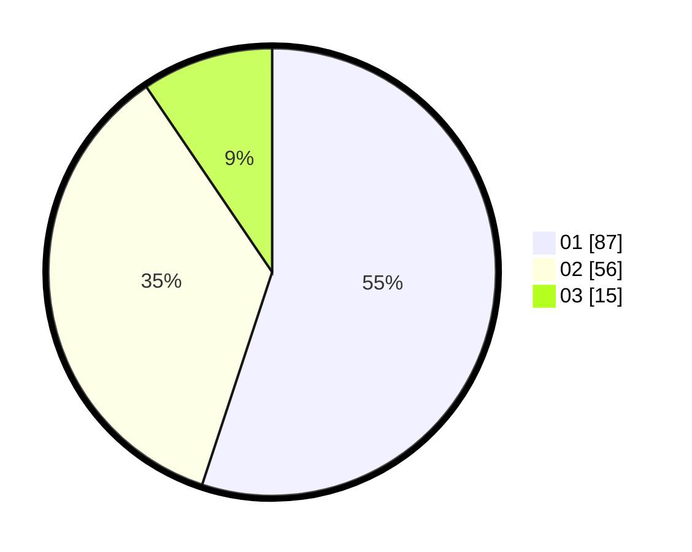

# Hasil

Hasil perolehan suara paslon dapat dilihat pada file paslon-01.txt, paslon-02.txt, dan paslon-03.txt.

Jika tidak ada, artinya data tersebut belum ada pada SIREKAP.

## Perolehan Suara

 * Paslon 01: **87**.
 * Paslon 02: **56**.
 * Paslon 03: **15**.

## Foto C Plano

https://sirekap-obj-formc.kpu.go.id/bfb9/pemilu/ppwp/31/73/05/10/06/3173051006125-20240215-194639--36969fe6-835f-4608-942f-cf26eecb4e98.jpg

https://sirekap-obj-formc.kpu.go.id/bfb9/pemilu/ppwp/31/73/05/10/06/3173051006125-20240215-194703--376418a3-510f-4e0f-baab-0fffcc67e508.jpg

https://sirekap-obj-formc.kpu.go.id/bfb9/pemilu/ppwp/31/73/05/10/06/3173051006125-20240215-194653--7a05cd9a-135a-4e51-8b2e-9e5838384b0e.jpg

## DATA PEMILIH TETAP

Jumlah pemilih dalam DPT: **204**.
 * L: **101**.
 * P: **103**.

## DATA PENGGUNA HAK PILIH

Jumlah pengguna hak pilih dalam DPT: **152**.
 * L: **72**.
 * P: **80**.

Jumlah pengguna hak pilih dalam DPTb: **0**.
 * L: **0**.
 * P: **0**.

Jumlah pengguna hak pilih dalam DPK: **9**.
 * L: **7**.
 * P: **2**.

Jumlah pengguna hak pilih: **161**.
 * L: **79**.
 * P: **82**.

## JUMLAH SUARA SAH DAN TIDAK SAH

JUMLAH SELURUH SUARA SAH: **158**.

JUMLAH SUARA TIDAK SAH: **3**.

JUMLAH SELURUH SUARA SAH DAN SUARA TIDAK SAH: **161**.
