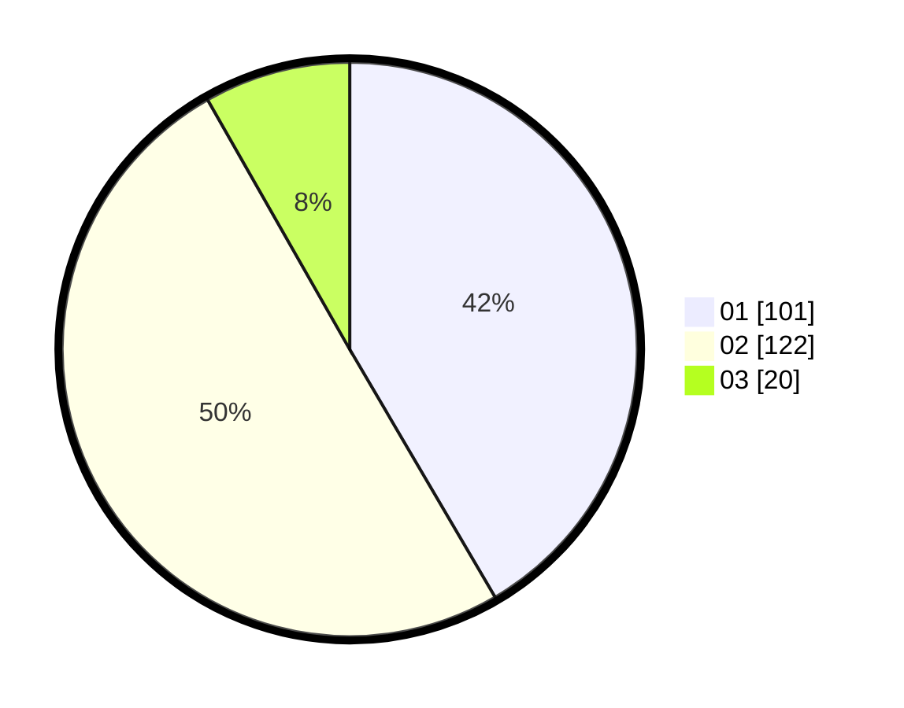

# Hasil

Hasil perolehan suara paslon dapat dilihat pada file paslon-01.txt, paslon-02.txt, dan paslon-03.txt.

Jika tidak ada, artinya data tersebut belum ada pada SIREKAP.

## Perolehan Suara

 * Paslon 01: **101**.
 * Paslon 02: **122**.
 * Paslon 03: **20**.

## Foto C Plano

https://sirekap-obj-formc.kpu.go.id/2464/pemilu/ppwp/31/73/05/10/06/3173051006127-20240216-211204--79bf0996-6f76-4c47-821c-4a18126ccb09.jpg

https://sirekap-obj-formc.kpu.go.id/2464/pemilu/ppwp/31/73/05/10/06/3173051006127-20240216-211205--cee3a2fb-b586-4d4b-9e7f-01751701fcf9.jpg

https://sirekap-obj-formc.kpu.go.id/2464/pemilu/ppwp/31/73/05/10/06/3173051006127-20240216-211204--42f9a303-b6fe-48e8-8c9e-182385fd9645.jpg

## DATA PEMILIH TETAP

Jumlah pemilih dalam DPT: **290**.
 * L: **141**.
 * P: **149**.

## DATA PENGGUNA HAK PILIH

Jumlah pengguna hak pilih dalam DPT: **242**.
 * L: **115**.
 * P: **127**.

Jumlah pengguna hak pilih dalam DPTb: **1**.
 * L: **1**.
 * P: **0**.

Jumlah pengguna hak pilih dalam DPK: **3**.
 * L: **1**.
 * P: **2**.

Jumlah pengguna hak pilih: **246**.
 * L: **117**.
 * P: **129**.

## JUMLAH SUARA SAH DAN TIDAK SAH

JUMLAH SELURUH SUARA SAH: **243**.

JUMLAH SUARA TIDAK SAH: **3**.

JUMLAH SELURUH SUARA SAH DAN SUARA TIDAK SAH: **246**.
