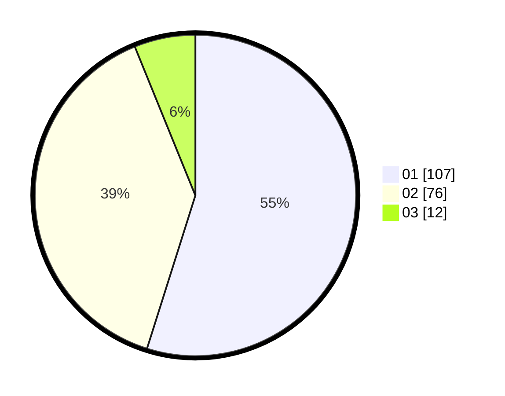

# Hasil

Hasil perolehan suara paslon dapat dilihat pada file paslon-01.txt, paslon-02.txt, dan paslon-03.txt.

Jika tidak ada, artinya data tersebut belum ada pada SIREKAP.

## Perolehan Suara

 * Paslon 01: **107**.
 * Paslon 02: **76**.
 * Paslon 03: **12**.

## Foto C Plano

https://sirekap-obj-formc.kpu.go.id/bd9c/pemilu/ppwp/31/73/05/10/06/3173051006129-20240218-054621--96cef2ab-0d47-4f65-8c37-b8d635a0c386.jpg

https://sirekap-obj-formc.kpu.go.id/bd9c/pemilu/ppwp/31/73/05/10/06/3173051006129-20240218-054707--4e56e99a-7070-48bb-b529-615f1ce5322d.jpg

https://sirekap-obj-formc.kpu.go.id/bd9c/pemilu/ppwp/31/73/05/10/06/3173051006129-20240218-054903--a716f67a-0cbe-4e1b-a570-990554b494ce.jpg
