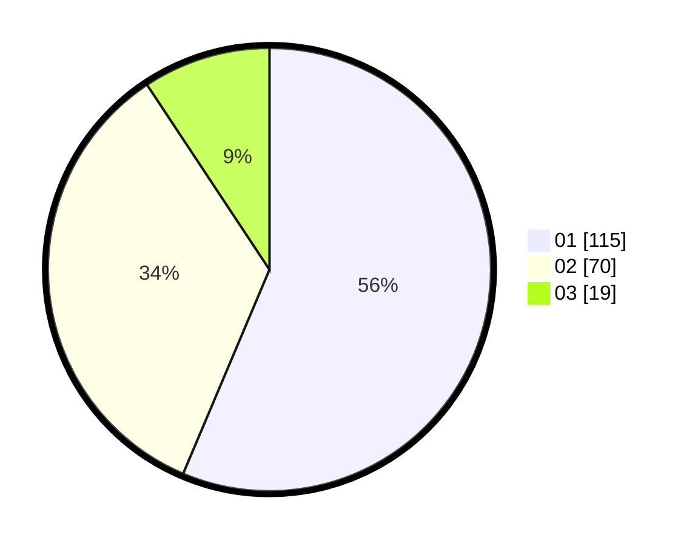

# Hasil

Hasil perolehan suara paslon dapat dilihat pada file paslon-01.txt, paslon-02.txt, dan paslon-03.txt.

Jika tidak ada, artinya data tersebut belum ada pada SIREKAP.

## Perolehan Suara

 * Paslon 01: **115**.
 * Paslon 02: **70**.
 * Paslon 03: **19**.

## Foto C Plano

https://sirekap-obj-formc.kpu.go.id/9b2b/pemilu/ppwp/31/73/05/10/06/3173051006130-20240216-123141--3f0012e0-d3db-41f3-aadd-be77a43ba2f8.jpg

https://sirekap-obj-formc.kpu.go.id/9b2b/pemilu/ppwp/31/73/05/10/06/3173051006130-20240216-123148--5092d6d0-d90b-49df-9755-76538667a2e2.jpg

https://sirekap-obj-formc.kpu.go.id/9b2b/pemilu/ppwp/31/73/05/10/06/3173051006130-20240216-123145--7a68e820-252b-400a-9952-c23f043ca468.jpg

## DATA PEMILIH TETAP

Jumlah pemilih dalam DPT: **292**.
 * L: **148**.
 * P: **144**.

## DATA PENGGUNA HAK PILIH

Jumlah pengguna hak pilih dalam DPT: **213**.
 * L: **105**.
 * P: **108**.

Jumlah pengguna hak pilih dalam DPTb: **0**.
 * L: **0**.
 * P: **0**.

Jumlah pengguna hak pilih dalam DPK: **0**.
 * L: **0**.
 * P: **0**.

Jumlah pengguna hak pilih: **213**.
 * L: **105**.
 * P: **108**.

## JUMLAH SUARA SAH DAN TIDAK SAH

JUMLAH SELURUH SUARA SAH: **204**.

JUMLAH SUARA TIDAK SAH: **9**.

JUMLAH SELURUH SUARA SAH DAN SUARA TIDAK SAH: **213**.
