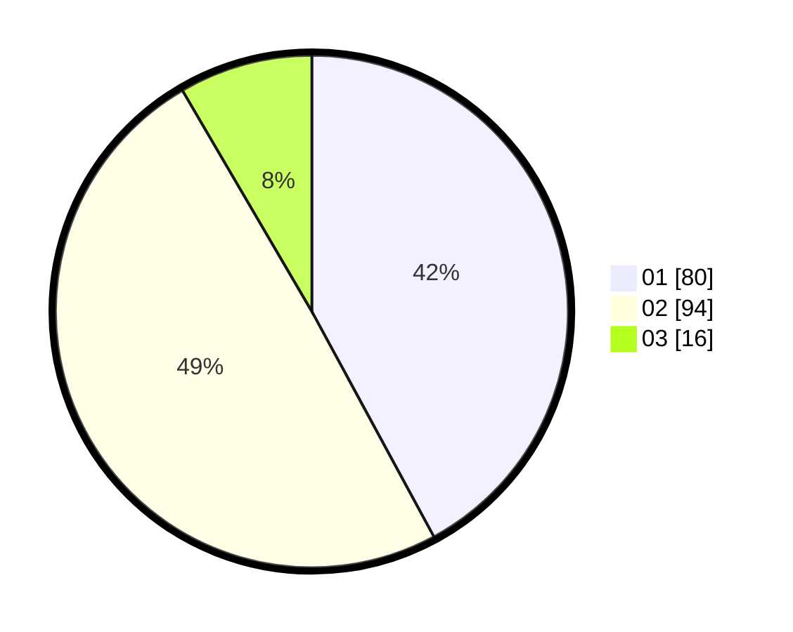

# Hasil

Hasil perolehan suara paslon dapat dilihat pada file paslon-01.txt, paslon-02.txt, dan paslon-03.txt.

Jika tidak ada, artinya data tersebut belum ada pada SIREKAP.

## Perolehan Suara

 * Paslon 01: **80**.
 * Paslon 02: **94**.
 * Paslon 03: **16**.

## Foto C Plano

https://sirekap-obj-formc.kpu.go.id/6ec6/pemilu/ppwp/31/73/05/10/06/3173051006134-20240215-013145--83803c57-dfdb-4d8e-b58b-eb9815885c1a.jpg

https://sirekap-obj-formc.kpu.go.id/6ec6/pemilu/ppwp/31/73/05/10/06/3173051006134-20240215-033122--759ad001-fd9b-4061-ab8a-44c8a6855214.jpg

https://sirekap-obj-formc.kpu.go.id/6ec6/pemilu/ppwp/31/73/05/10/06/3173051006134-20240215-033252--e4bb309b-4fbb-49fb-a2df-7f263128b2ee.jpg
