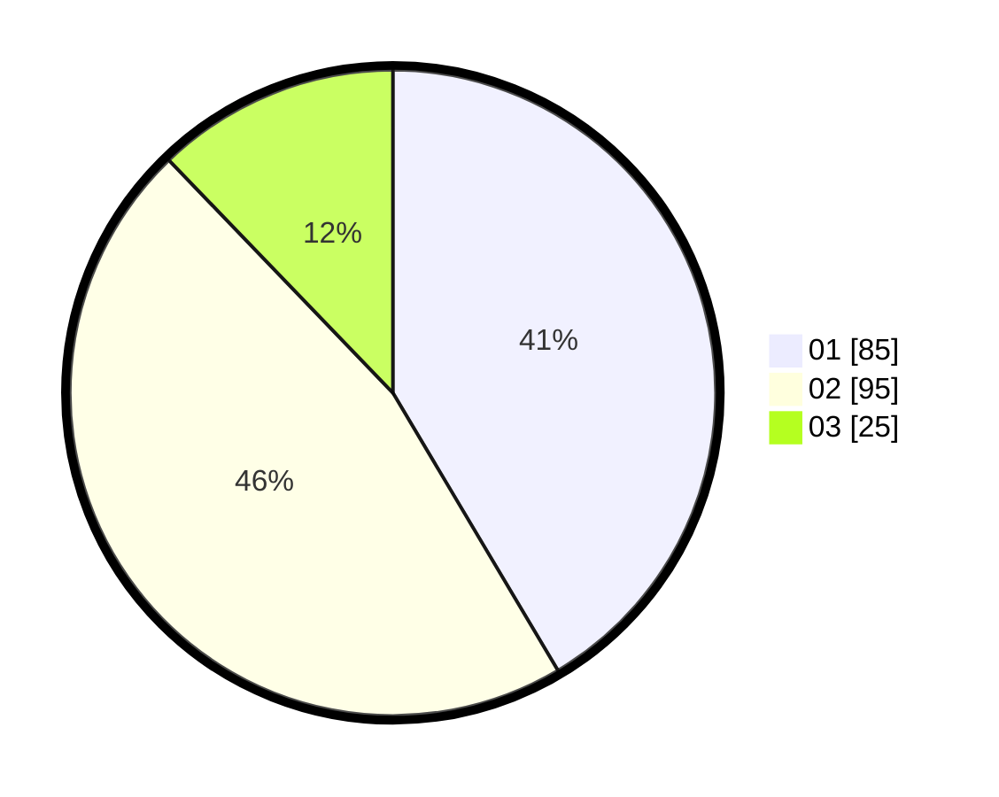

# Hasil

Hasil perolehan suara paslon dapat dilihat pada file paslon-01.txt, paslon-02.txt, dan paslon-03.txt.

Jika tidak ada, artinya data tersebut belum ada pada SIREKAP.

## Perolehan Suara

 * Paslon 01: **85**.
 * Paslon 02: **95**.
 * Paslon 03: **25**.

## Foto C Plano

https://sirekap-obj-formc.kpu.go.id/423e/pemilu/ppwp/31/73/05/10/06/3173051006135-20240214-235410--09baaa6d-180e-49be-85f1-b0fda7905419.jpg

https://sirekap-obj-formc.kpu.go.id/423e/pemilu/ppwp/31/73/05/10/06/3173051006135-20240214-235650--0a5e3350-41bf-4097-bbb5-fda39217e334.jpg

https://sirekap-obj-formc.kpu.go.id/423e/pemilu/ppwp/31/73/05/10/06/3173051006135-20240214-235733--5dc6e41d-3650-4f87-b5d9-e54e3bf30656.jpg

## DATA PEMILIH TETAP

Jumlah pemilih dalam DPT: **274**.
 * L: **134**.
 * P: **140**.

## DATA PENGGUNA HAK PILIH

Jumlah pengguna hak pilih dalam DPT: **213**.
 * L: **100**.
 * P: **113**.

Jumlah pengguna hak pilih dalam DPTb: **0**.
 * L: **0**.
 * P: **0**.

Jumlah pengguna hak pilih dalam DPK: **0**.
 * L: **0**.
 * P: **0**.

Jumlah pengguna hak pilih: **213**.
 * L: **100**.
 * P: **113**.

## JUMLAH SUARA SAH DAN TIDAK SAH

JUMLAH SELURUH SUARA SAH: **209**.

JUMLAH SUARA TIDAK SAH: **4**.

JUMLAH SELURUH SUARA SAH DAN SUARA TIDAK SAH: **213**.
