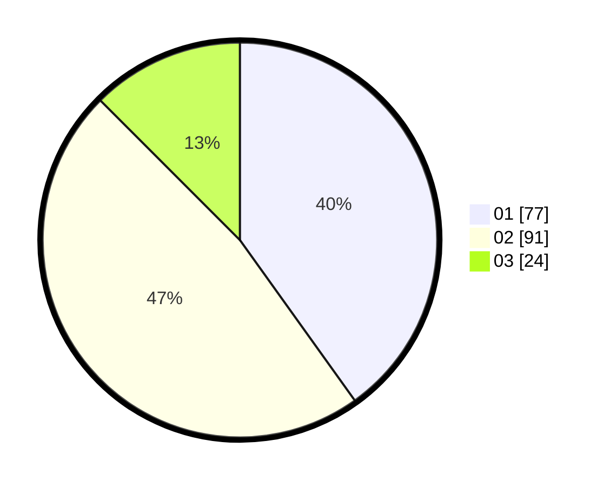

# Hasil

Hasil perolehan suara paslon dapat dilihat pada file paslon-01.txt, paslon-02.txt, dan paslon-03.txt.

Jika tidak ada, artinya data tersebut belum ada pada SIREKAP.

## Perolehan Suara

 * Paslon 01: **77**.
 * Paslon 02: **91**.
 * Paslon 03: **24**.

## Foto C Plano

https://sirekap-obj-formc.kpu.go.id/5231/pemilu/ppwp/31/73/05/10/06/3173051006136-20240214-224003--70c6c502-a983-429e-b88b-6b8bbe8a3f93.jpg

https://sirekap-obj-formc.kpu.go.id/5231/pemilu/ppwp/31/73/05/10/06/3173051006136-20240214-224226--3b453764-5419-4c57-8ec4-0d4e251f3f02.jpg

https://sirekap-obj-formc.kpu.go.id/5231/pemilu/ppwp/31/73/05/10/06/3173051006136-20240214-224432--226ea6ab-c274-42d0-a1db-92991fff57ec.jpg

## DATA PEMILIH TETAP

Jumlah pemilih dalam DPT: **253**.
 * L: **144**.
 * P: **109**.

## DATA PENGGUNA HAK PILIH

Jumlah pengguna hak pilih dalam DPT: **185**.
 * L: **82**.
 * P: **103**.

Jumlah pengguna hak pilih dalam DPTb: **2**.
 * L: **0**.
 * P: **2**.

Jumlah pengguna hak pilih dalam DPK: **6**.
 * L: **3**.
 * P: **3**.

Jumlah pengguna hak pilih: **193**.
 * L: **85**.
 * P: **108**.

## JUMLAH SUARA SAH DAN TIDAK SAH

JUMLAH SELURUH SUARA SAH: **192**.

JUMLAH SUARA TIDAK SAH: **1**.

JUMLAH SELURUH SUARA SAH DAN SUARA TIDAK SAH: **193**.
