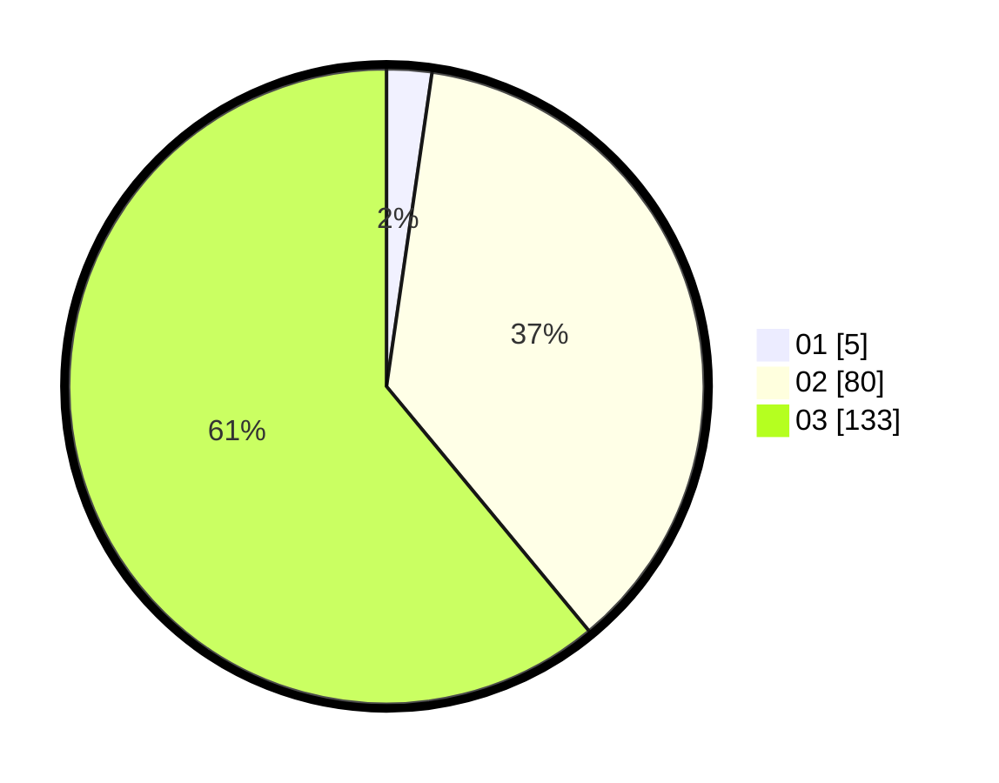

# Hasil

Hasil perolehan suara paslon dapat dilihat pada file paslon-01.txt, paslon-02.txt, dan paslon-03.txt.

Jika tidak ada, artinya data tersebut belum ada pada SIREKAP.

## Perolehan Suara

 * Paslon 01: **5**.
 * Paslon 02: **80**.
 * Paslon 03: **133**.

## Foto C Plano

https://sirekap-obj-formc.kpu.go.id/c6b6/pemilu/ppwp/31/73/05/10/06/3173051006143-20240214-215800--2233a6cb-78a5-4668-9df9-9810fbe87823.jpg

https://sirekap-obj-formc.kpu.go.id/c6b6/pemilu/ppwp/31/73/05/10/06/3173051006143-20240214-215830--91b1a124-d134-41ab-99ef-17b62cc6aed1.jpg

https://sirekap-obj-formc.kpu.go.id/c6b6/pemilu/ppwp/31/73/05/10/06/3173051006143-20240214-215858--c798d653-9fb2-442c-b76e-35667fdeed56.jpg
