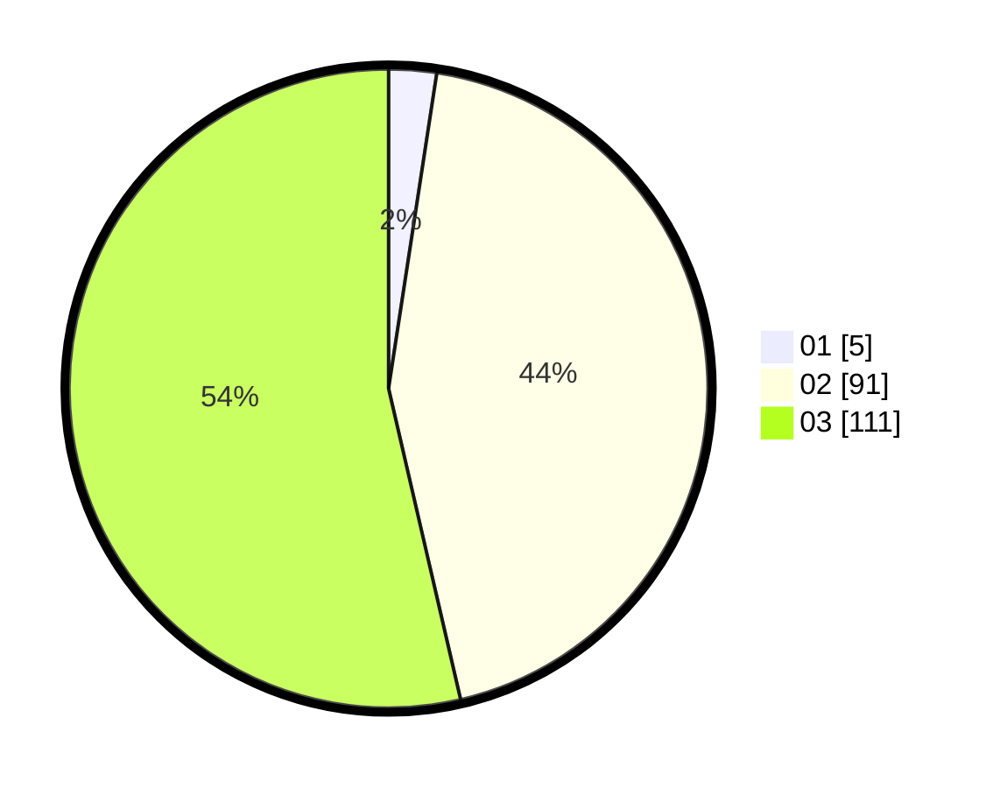

# Hasil

Hasil perolehan suara paslon dapat dilihat pada file paslon-01.txt, paslon-02.txt, dan paslon-03.txt.

Jika tidak ada, artinya data tersebut belum ada pada SIREKAP.

## Perolehan Suara

 * Paslon 01: **5**.
 * Paslon 02: **91**.
 * Paslon 03: **111**.

## Foto C Plano

https://sirekap-obj-formc.kpu.go.id/eeab/pemilu/ppwp/31/73/05/10/06/3173051006146-20240214-202642--b5d9fe04-cb44-4c67-8f09-530a8c3a0153.jpg

https://sirekap-obj-formc.kpu.go.id/eeab/pemilu/ppwp/31/73/05/10/06/3173051006146-20240214-202739--bd666e44-3ee4-412a-9b32-1eacc9d2daa9.jpg

https://sirekap-obj-formc.kpu.go.id/eeab/pemilu/ppwp/31/73/05/10/06/3173051006146-20240214-202824--878d1aae-5040-4033-ab43-d5e6d0029935.jpg
