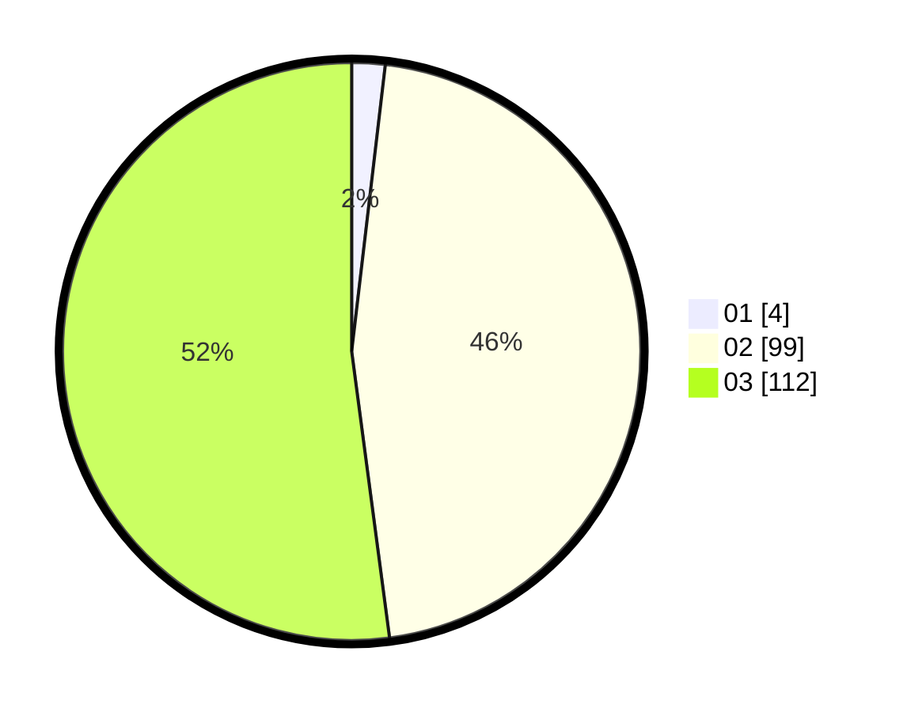

# Hasil

Hasil perolehan suara paslon dapat dilihat pada file paslon-01.txt, paslon-02.txt, dan paslon-03.txt.

Jika tidak ada, artinya data tersebut belum ada pada SIREKAP.

## Perolehan Suara

 * Paslon 01: **4**.
 * Paslon 02: **99**.
 * Paslon 03: **112**.

## Foto C Plano

https://sirekap-obj-formc.kpu.go.id/9c9b/pemilu/ppwp/31/73/05/10/06/3173051006148-20240214-193020--30d241a2-ab01-4dc2-85d9-ea47c1a084c9.jpg

https://sirekap-obj-formc.kpu.go.id/9c9b/pemilu/ppwp/31/73/05/10/06/3173051006148-20240214-193024--dea6ee01-7125-4b32-8865-fdee96165507.jpg

https://sirekap-obj-formc.kpu.go.id/9c9b/pemilu/ppwp/31/73/05/10/06/3173051006148-20240214-193029--d435d12f-8b2a-410f-9de7-c037c97a5181.jpg

## DATA PEMILIH TETAP

Jumlah pemilih dalam DPT: **278**.
 * L: **135**.
 * P: **143**.

## DATA PENGGUNA HAK PILIH

Jumlah pengguna hak pilih dalam DPT: **192**.
 * L: **97**.
 * P: **95**.

Jumlah pengguna hak pilih dalam DPTb: **15**.
 * L: **5**.
 * P: **10**.

Jumlah pengguna hak pilih dalam DPK: **8**.
 * L: **3**.
 * P: **5**.

Jumlah pengguna hak pilih: **215**.
 * L: **105**.
 * P: **110**.

## JUMLAH SUARA SAH DAN TIDAK SAH

JUMLAH SELURUH SUARA SAH: **215**.

JUMLAH SUARA TIDAK SAH: **0**.

JUMLAH SELURUH SUARA SAH DAN SUARA TIDAK SAH: **215**.
