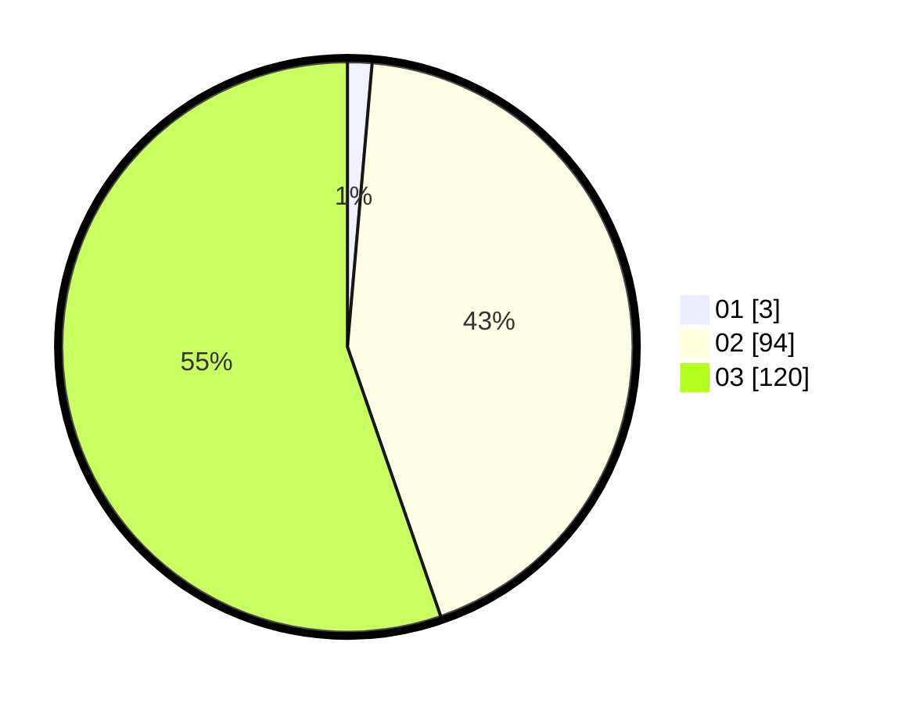

# Hasil

Hasil perolehan suara paslon dapat dilihat pada file paslon-01.txt, paslon-02.txt, dan paslon-03.txt.

Jika tidak ada, artinya data tersebut belum ada pada SIREKAP.

## Perolehan Suara

 * Paslon 01: **3**.
 * Paslon 02: **94**.
 * Paslon 03: **120**.

## Foto C Plano

https://sirekap-obj-formc.kpu.go.id/6a61/pemilu/ppwp/31/73/05/10/06/3173051006150-20240214-160102--da18fb1d-eb28-4a65-a925-a41400c09383.jpg

https://sirekap-obj-formc.kpu.go.id/6a61/pemilu/ppwp/31/73/05/10/06/3173051006150-20240214-185940--48c246af-0de6-4796-b5f3-246719d59284.jpg

https://sirekap-obj-formc.kpu.go.id/6a61/pemilu/ppwp/31/73/05/10/06/3173051006150-20240214-185943--1c3460c3-12e8-40b2-8727-cfeba0ec9d24.jpg

## DATA PEMILIH TETAP

Jumlah pemilih dalam DPT: **267**.
 * L: **120**.
 * P: **147**.

## DATA PENGGUNA HAK PILIH

Jumlah pengguna hak pilih dalam DPT: **202**.
 * L: **89**.
 * P: **113**.

Jumlah pengguna hak pilih dalam DPTb: **8**.
 * L: **5**.
 * P: **3**.

Jumlah pengguna hak pilih dalam DPK: **7**.
 * L: **4**.
 * P: **3**.

Jumlah pengguna hak pilih: **217**.
 * L: **98**.
 * P: **119**.

## JUMLAH SUARA SAH DAN TIDAK SAH

JUMLAH SELURUH SUARA SAH: **217**.

JUMLAH SUARA TIDAK SAH: **0**.

JUMLAH SELURUH SUARA SAH DAN SUARA TIDAK SAH: **217**.
