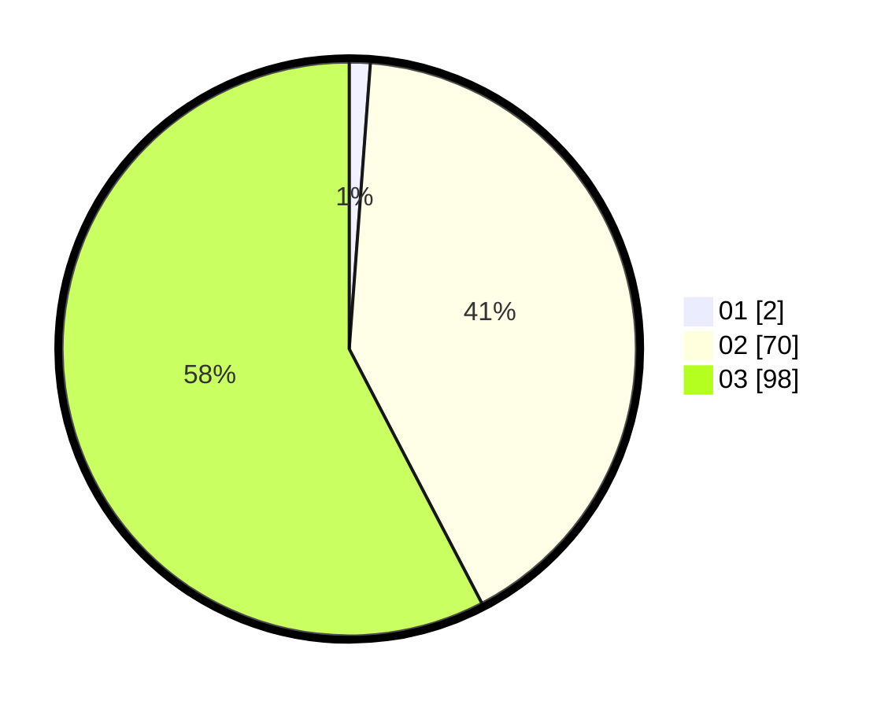

# Hasil

Hasil perolehan suara paslon dapat dilihat pada file paslon-01.txt, paslon-02.txt, dan paslon-03.txt.

Jika tidak ada, artinya data tersebut belum ada pada SIREKAP.

## Perolehan Suara

 * Paslon 01: **2**.
 * Paslon 02: **70**.
 * Paslon 03: **98**.

## Foto C Plano

https://sirekap-obj-formc.kpu.go.id/0e5b/pemilu/ppwp/31/73/05/10/06/3173051006151-20240214-155111--43e1ddd1-1197-4a4f-b7c1-4d38815ec166.jpg

https://sirekap-obj-formc.kpu.go.id/0e5b/pemilu/ppwp/31/73/05/10/06/3173051006151-20240214-155105--aded124b-c64d-45ce-8751-865d5eb81952.jpg

https://sirekap-obj-formc.kpu.go.id/0e5b/pemilu/ppwp/31/73/05/10/06/3173051006151-20240214-155050--f6573ab8-f00c-4a04-aa32-f6b9096cdfe5.jpg

## DATA PEMILIH TETAP

Jumlah pemilih dalam DPT: **235**.
 * L: **117**.
 * P: **118**.

## DATA PENGGUNA HAK PILIH

Jumlah pengguna hak pilih dalam DPT: **166**.
 * L: **84**.
 * P: **82**.

Jumlah pengguna hak pilih dalam DPTb: **4**.
 * L: **3**.
 * P: **1**.

Jumlah pengguna hak pilih dalam DPK: **2**.
 * L: **0**.
 * P: **2**.

Jumlah pengguna hak pilih: **172**.
 * L: **87**.
 * P: **85**.

## JUMLAH SUARA SAH DAN TIDAK SAH

JUMLAH SELURUH SUARA SAH: **170**.

JUMLAH SUARA TIDAK SAH: **2**.

JUMLAH SELURUH SUARA SAH DAN SUARA TIDAK SAH: **172**.
