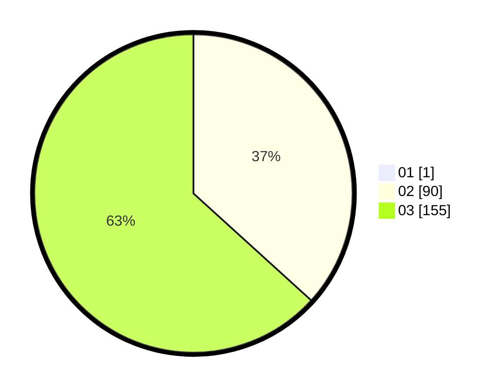

# Hasil

Hasil perolehan suara paslon dapat dilihat pada file paslon-01.txt, paslon-02.txt, dan paslon-03.txt.

Jika tidak ada, artinya data tersebut belum ada pada SIREKAP.

## Perolehan Suara

 * Paslon 01: **1**.
 * Paslon 02: **90**.
 * Paslon 03: **155**.

## Foto C Plano

https://sirekap-obj-formc.kpu.go.id/9445/pemilu/ppwp/31/73/05/10/06/3173051006157-20240216-085104--ea49b770-85dc-447c-895e-3763a5978228.jpg

https://sirekap-obj-formc.kpu.go.id/9445/pemilu/ppwp/31/73/05/10/06/3173051006157-20240216-085018--e0182cae-fa0f-463b-aa95-f95d65e4b9ab.jpg

https://sirekap-obj-formc.kpu.go.id/9445/pemilu/ppwp/31/73/05/10/06/3173051006157-20240216-084919--04ec99a8-c92a-44dc-96ce-286e30bdab39.jpg
