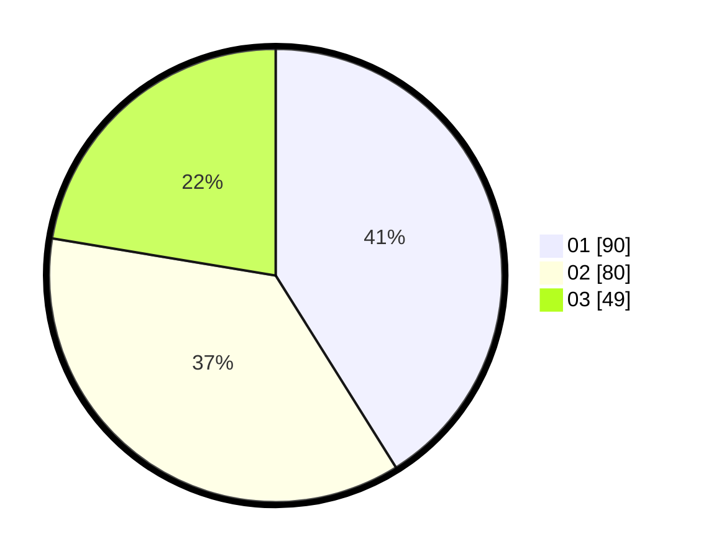

# Hasil

Hasil perolehan suara paslon dapat dilihat pada file paslon-01.txt, paslon-02.txt, dan paslon-03.txt.

Jika tidak ada, artinya data tersebut belum ada pada SIREKAP.

## Perolehan Suara

 * Paslon 01: **90**.
 * Paslon 02: **80**.
 * Paslon 03: **49**.

## Foto C Plano

https://sirekap-obj-formc.kpu.go.id/bc37/pemilu/ppwp/31/73/05/10/07/3173051007001-20240216-031243--80aba23f-576f-44a1-95d9-a65733b28f40.jpg

https://sirekap-obj-formc.kpu.go.id/bc37/pemilu/ppwp/31/73/05/10/07/3173051007001-20240216-031250--347a4817-1628-4629-b4c8-86f0c7357d17.jpg

https://sirekap-obj-formc.kpu.go.id/bc37/pemilu/ppwp/31/73/05/10/07/3173051007001-20240214-155006--c4f9bd66-e43d-48f3-b117-73c13a73198b.jpg

## DATA PEMILIH TETAP

Jumlah pemilih dalam DPT: **278**.
 * L: **141**.
 * P: **137**.

## DATA PENGGUNA HAK PILIH

Jumlah pengguna hak pilih dalam DPT: **215**.
 * L: **107**.
 * P: **108**.

Jumlah pengguna hak pilih dalam DPTb: **1**.
 * L: **1**.
 * P: **0**.

Jumlah pengguna hak pilih dalam DPK: **10**.
 * L: **4**.
 * P: **6**.

Jumlah pengguna hak pilih: **226**.
 * L: **112**.
 * P: **114**.

## JUMLAH SUARA SAH DAN TIDAK SAH

JUMLAH SELURUH SUARA SAH: **219**.

JUMLAH SUARA TIDAK SAH: **7**.

JUMLAH SELURUH SUARA SAH DAN SUARA TIDAK SAH: **226**.
