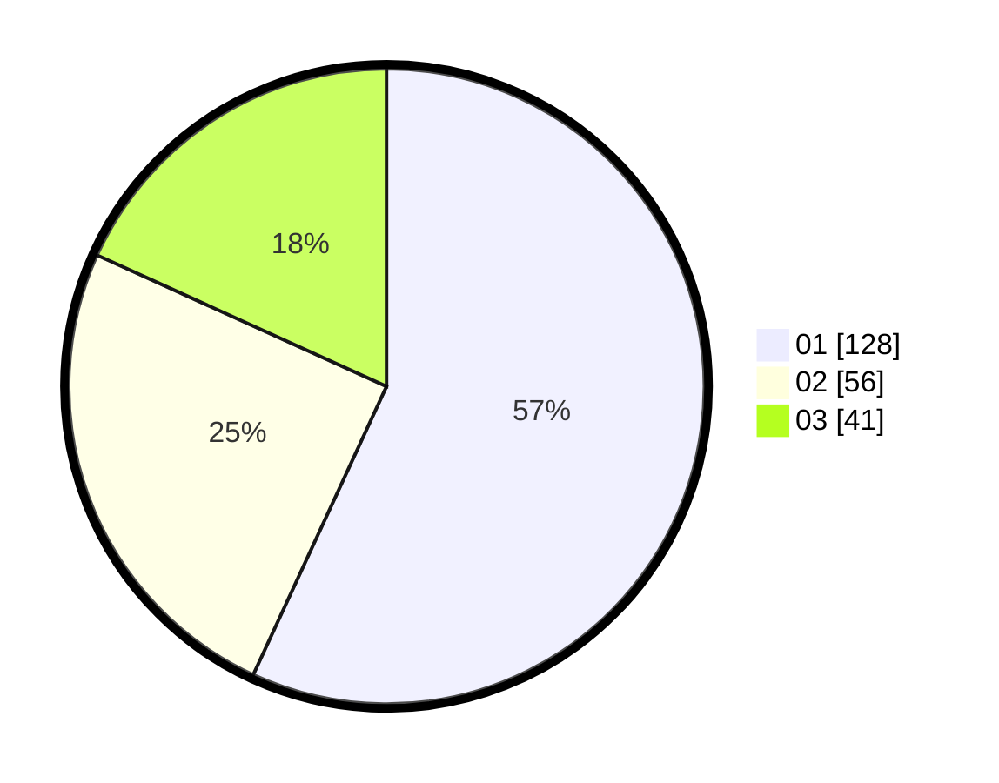

# Hasil

Hasil perolehan suara paslon dapat dilihat pada file paslon-01.txt, paslon-02.txt, dan paslon-03.txt.

Jika tidak ada, artinya data tersebut belum ada pada SIREKAP.

## Perolehan Suara

 * Paslon 01: **128**.
 * Paslon 02: **56**.
 * Paslon 03: **41**.

## Foto C Plano

https://sirekap-obj-formc.kpu.go.id/23ef/pemilu/ppwp/31/73/05/10/07/3173051007004-20240214-204153--5dd32966-cb07-4096-941c-4e8d8c07577d.jpg

https://sirekap-obj-formc.kpu.go.id/23ef/pemilu/ppwp/31/73/05/10/07/3173051007004-20240214-204340--522944a3-7ca1-4e4d-8b3b-012ea412fb6e.jpg

https://sirekap-obj-formc.kpu.go.id/23ef/pemilu/ppwp/31/73/05/10/07/3173051007004-20240214-204445--dc6bc118-2f52-46e9-9967-95bca0faad05.jpg
