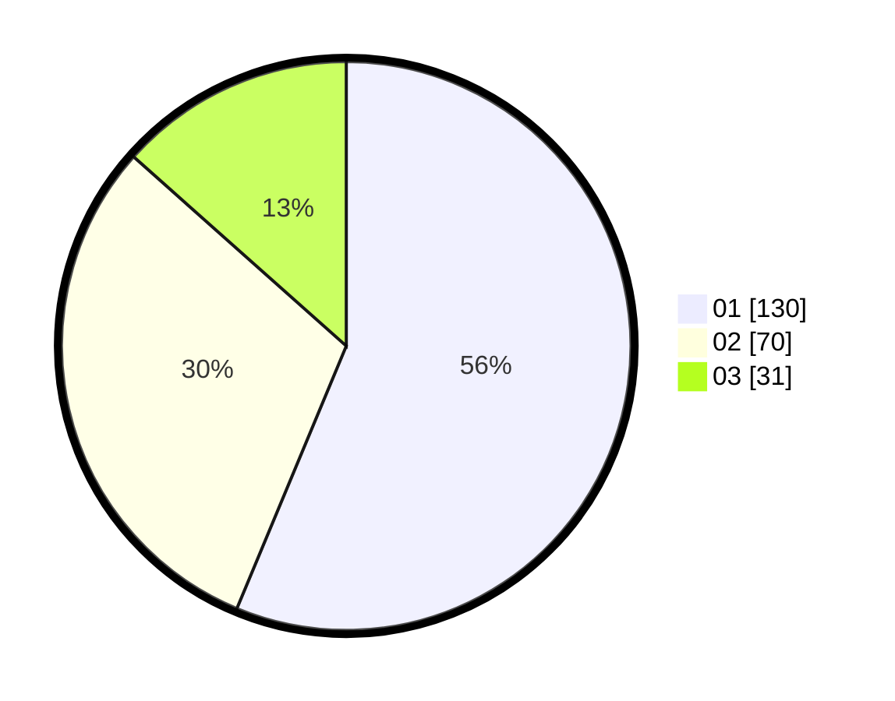

# Hasil

Hasil perolehan suara paslon dapat dilihat pada file paslon-01.txt, paslon-02.txt, dan paslon-03.txt.

Jika tidak ada, artinya data tersebut belum ada pada SIREKAP.

## Perolehan Suara

 * Paslon 01: **130**.
 * Paslon 02: **70**.
 * Paslon 03: **31**.

## Foto C Plano

https://sirekap-obj-formc.kpu.go.id/36e1/pemilu/ppwp/31/73/05/10/07/3173051007005-20240216-162753--7a445eea-4db7-4066-a1dd-b5c76051f8ef.jpg

https://sirekap-obj-formc.kpu.go.id/36e1/pemilu/ppwp/31/73/05/10/07/3173051007005-20240214-225613--167f6f5a-e705-4d5f-8444-5de053b4523c.jpg

https://sirekap-obj-formc.kpu.go.id/36e1/pemilu/ppwp/31/73/05/10/07/3173051007005-20240214-225632--b783dfc5-3b98-4515-a4e6-5e45d886897f.jpg

## DATA PEMILIH TETAP

Jumlah pemilih dalam DPT: **232**.
 * L: **120**.
 * P: **112**.

## DATA PENGGUNA HAK PILIH

Jumlah pengguna hak pilih dalam DPT: **215**.
 * L: **112**.
 * P: **103**.

Jumlah pengguna hak pilih dalam DPTb: **15**.
 * L: **8**.
 * P: **7**.

Jumlah pengguna hak pilih dalam DPK: **2**.
 * L: **0**.
 * P: **2**.

Jumlah pengguna hak pilih: **232**.
 * L: **120**.
 * P: **112**.

## JUMLAH SUARA SAH DAN TIDAK SAH

JUMLAH SELURUH SUARA SAH: **231**.

JUMLAH SUARA TIDAK SAH: **1**.

JUMLAH SELURUH SUARA SAH DAN SUARA TIDAK SAH: **232**.
