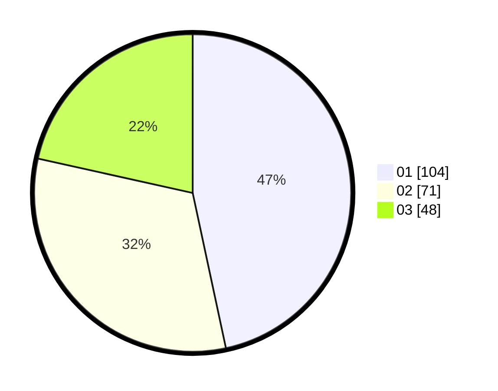

# Hasil

Hasil perolehan suara paslon dapat dilihat pada file paslon-01.txt, paslon-02.txt, dan paslon-03.txt.

Jika tidak ada, artinya data tersebut belum ada pada SIREKAP.

## Perolehan Suara

 * Paslon 01: **104**.
 * Paslon 02: **71**.
 * Paslon 03: **48**.

## Foto C Plano

https://sirekap-obj-formc.kpu.go.id/395a/pemilu/ppwp/31/73/05/10/07/3173051007006-20240214-211341--85bec160-87af-4abb-a64f-fe3f832db7e1.jpg

https://sirekap-obj-formc.kpu.go.id/395a/pemilu/ppwp/31/73/05/10/07/3173051007006-20240214-211450--be99fe4c-c2a8-4604-8787-66eb497033d5.jpg

https://sirekap-obj-formc.kpu.go.id/395a/pemilu/ppwp/31/73/05/10/07/3173051007006-20240214-211628--bf500a7b-32bd-444e-b918-1420a0afee87.jpg
