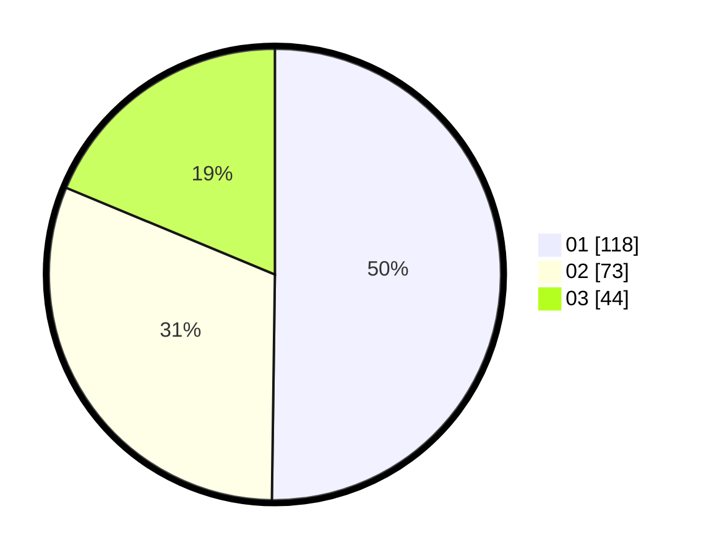

# Hasil

Hasil perolehan suara paslon dapat dilihat pada file paslon-01.txt, paslon-02.txt, dan paslon-03.txt.

Jika tidak ada, artinya data tersebut belum ada pada SIREKAP.

## Perolehan Suara

 * Paslon 01: **118**.
 * Paslon 02: **73**.
 * Paslon 03: **44**.

## Foto C Plano

https://sirekap-obj-formc.kpu.go.id/1d93/pemilu/ppwp/31/73/05/10/07/3173051007007-20240217-010245--8a804623-1167-41c7-b736-6a8a72826de4.jpg

https://sirekap-obj-formc.kpu.go.id/1d93/pemilu/ppwp/31/73/05/10/07/3173051007007-20240217-005912--dd0ca0e6-c7d6-476e-9950-ee2e1fbc256c.jpg

https://sirekap-obj-formc.kpu.go.id/1d93/pemilu/ppwp/31/73/05/10/07/3173051007007-20240215-035102--b2b7f5e4-aacb-495d-82c6-6a9ad74ee92b.jpg

## DATA PEMILIH TETAP

Jumlah pemilih dalam DPT: **290**.
 * L: **143**.
 * P: **147**.

## DATA PENGGUNA HAK PILIH

Jumlah pengguna hak pilih dalam DPT: **237**.
 * L: **114**.
 * P: **123**.

Jumlah pengguna hak pilih dalam DPTb: **0**.
 * L: **0**.
 * P: **0**.

Jumlah pengguna hak pilih dalam DPK: **1**.
 * L: **1**.
 * P: **0**.

Jumlah pengguna hak pilih: **238**.
 * L: **115**.
 * P: **123**.

## JUMLAH SUARA SAH DAN TIDAK SAH

JUMLAH SELURUH SUARA SAH: **235**.

JUMLAH SUARA TIDAK SAH: **3**.

JUMLAH SELURUH SUARA SAH DAN SUARA TIDAK SAH: **238**.
