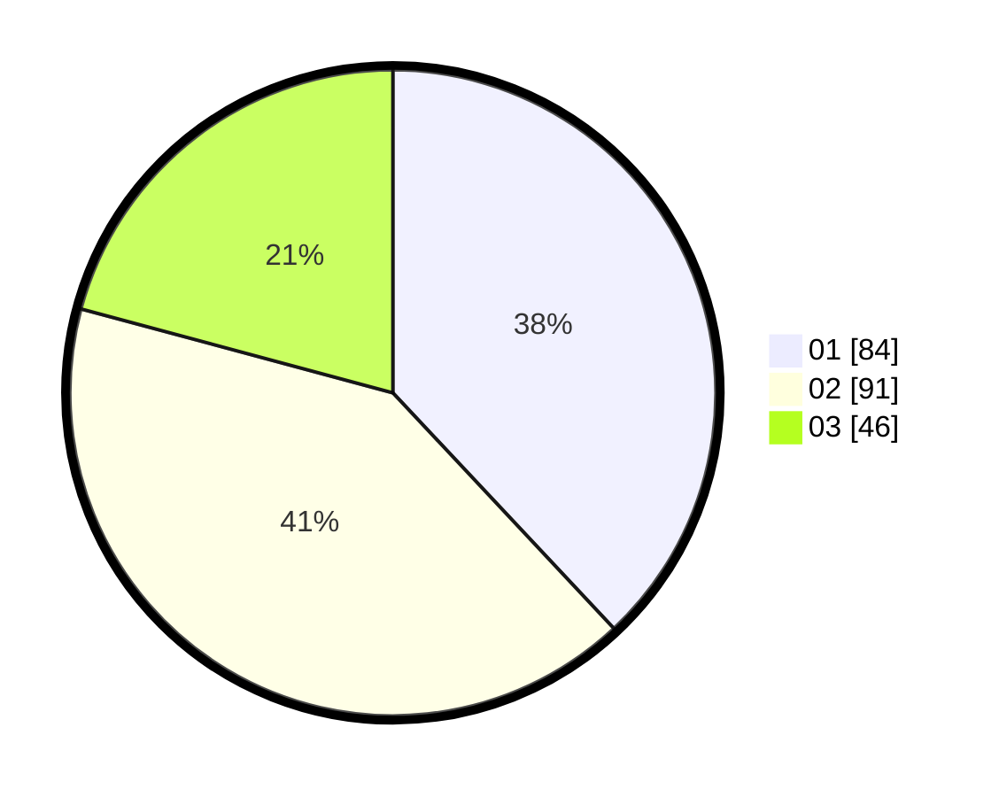

# Hasil

Hasil perolehan suara paslon dapat dilihat pada file paslon-01.txt, paslon-02.txt, dan paslon-03.txt.

Jika tidak ada, artinya data tersebut belum ada pada SIREKAP.

## Perolehan Suara

 * Paslon 01: **84**.
 * Paslon 02: **91**.
 * Paslon 03: **46**.

## Foto C Plano

https://sirekap-obj-formc.kpu.go.id/5316/pemilu/ppwp/31/73/05/10/07/3173051007009-20240214-220700--6c79e703-f74f-4d0b-a976-7da7daedd57b.jpg

https://sirekap-obj-formc.kpu.go.id/5316/pemilu/ppwp/31/73/05/10/07/3173051007009-20240214-220911--3e0ba612-ad07-420d-933c-4abb89851995.jpg

https://sirekap-obj-formc.kpu.go.id/5316/pemilu/ppwp/31/73/05/10/07/3173051007009-20240214-221124--00406ef9-4ad7-48d5-9565-fd5bd9cfed59.jpg

## DATA PEMILIH TETAP

Jumlah pemilih dalam DPT: **284**.
 * L: **135**.
 * P: **149**.

## DATA PENGGUNA HAK PILIH

Jumlah pengguna hak pilih dalam DPT: **221**.
 * L: **102**.
 * P: **119**.

Jumlah pengguna hak pilih dalam DPTb: **3**.
 * L: **0**.
 * P: **3**.

Jumlah pengguna hak pilih dalam DPK: **0**.
 * L: **0**.
 * P: **0**.

Jumlah pengguna hak pilih: **224**.
 * L: **102**.
 * P: **122**.

## JUMLAH SUARA SAH DAN TIDAK SAH

JUMLAH SELURUH SUARA SAH: **221**.

JUMLAH SUARA TIDAK SAH: **3**.

JUMLAH SELURUH SUARA SAH DAN SUARA TIDAK SAH: **224**.
