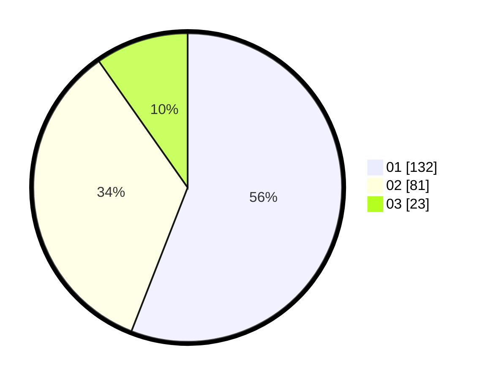

# Hasil

Hasil perolehan suara paslon dapat dilihat pada file paslon-01.txt, paslon-02.txt, dan paslon-03.txt.

Jika tidak ada, artinya data tersebut belum ada pada SIREKAP.

## Perolehan Suara

 * Paslon 01: **132**.
 * Paslon 02: **81**.
 * Paslon 03: **23**.

## Foto C Plano

https://sirekap-obj-formc.kpu.go.id/9344/pemilu/ppwp/31/73/05/10/07/3173051007012-20240214-232550--ebfd7ede-0185-47f6-b3a3-c6e62653a18d.jpg

https://sirekap-obj-formc.kpu.go.id/9344/pemilu/ppwp/31/73/05/10/07/3173051007012-20240217-131453--ce61424b-5ff1-4b19-82ce-ca0990f0076f.jpg

https://sirekap-obj-formc.kpu.go.id/9344/pemilu/ppwp/31/73/05/10/07/3173051007012-20240214-233351--7050dc2d-2a5c-41f2-b26a-f79fbbe9e8b5.jpg

## DATA PEMILIH TETAP

Jumlah pemilih dalam DPT: **275**.
 * L: **140**.
 * P: **135**.

## DATA PENGGUNA HAK PILIH

Jumlah pengguna hak pilih dalam DPT: **230**.
 * L: **115**.
 * P: **115**.

Jumlah pengguna hak pilih dalam DPTb: **0**.
 * L: **0**.
 * P: **0**.

Jumlah pengguna hak pilih dalam DPK: **6**.
 * L: **2**.
 * P: **4**.

Jumlah pengguna hak pilih: **236**.
 * L: **117**.
 * P: **119**.

## JUMLAH SUARA SAH DAN TIDAK SAH

JUMLAH SELURUH SUARA SAH: **236**.

JUMLAH SUARA TIDAK SAH: **0**.

JUMLAH SELURUH SUARA SAH DAN SUARA TIDAK SAH: **236**.
