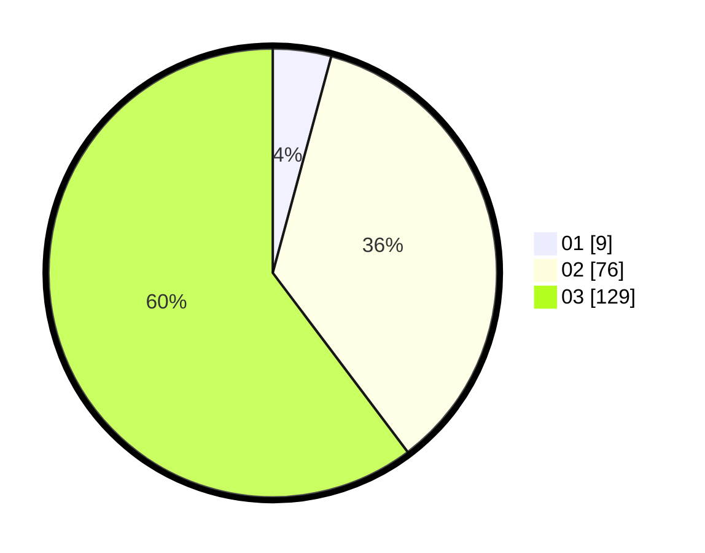

# Hasil

Hasil perolehan suara paslon dapat dilihat pada file paslon-01.txt, paslon-02.txt, dan paslon-03.txt.

Jika tidak ada, artinya data tersebut belum ada pada SIREKAP.

## Perolehan Suara

 * Paslon 01: **9**.
 * Paslon 02: **76**.
 * Paslon 03: **129**.

## Foto C Plano

https://sirekap-obj-formc.kpu.go.id/da2a/pemilu/ppwp/31/73/05/10/07/3173051007015-20240216-210338--a427c043-a124-4875-bd32-88412d41440f.jpg

https://sirekap-obj-formc.kpu.go.id/da2a/pemilu/ppwp/31/73/05/10/07/3173051007015-20240216-210346--908c826c-809a-4dd8-af50-d292658c2ae3.jpg

https://sirekap-obj-formc.kpu.go.id/da2a/pemilu/ppwp/31/73/05/10/07/3173051007015-20240216-210358--ada9dd3b-bdf9-4f1f-adf8-d69eaca6c530.jpg
