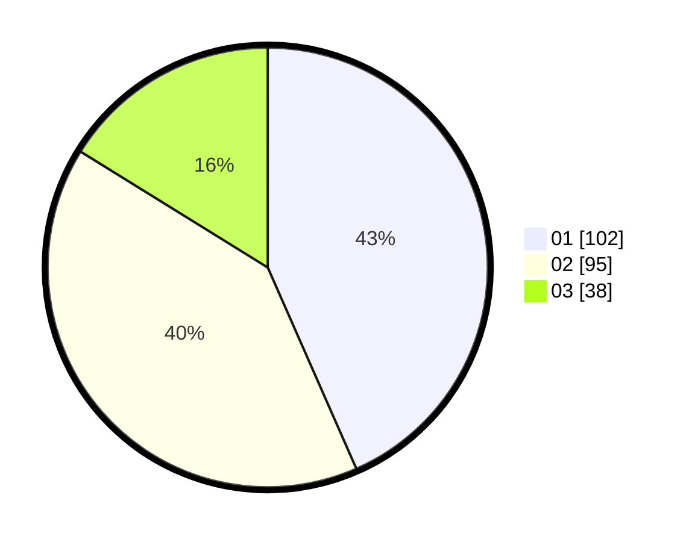

# Hasil

Hasil perolehan suara paslon dapat dilihat pada file paslon-01.txt, paslon-02.txt, dan paslon-03.txt.

Jika tidak ada, artinya data tersebut belum ada pada SIREKAP.

## Perolehan Suara

 * Paslon 01: **102**.
 * Paslon 02: **95**.
 * Paslon 03: **38**.

## Foto C Plano

https://sirekap-obj-formc.kpu.go.id/7ade/pemilu/ppwp/31/73/05/10/07/3173051007018-20240214-190117--9a7d3027-3676-45ac-a053-b83640d656e6.jpg

https://sirekap-obj-formc.kpu.go.id/7ade/pemilu/ppwp/31/73/05/10/07/3173051007018-20240214-201451--4676ff5f-6aed-4847-8176-a140b79796f4.jpg

https://sirekap-obj-formc.kpu.go.id/7ade/pemilu/ppwp/31/73/05/10/07/3173051007018-20240214-193439--9e57ef46-ae51-4e06-a083-469943aadfbc.jpg
