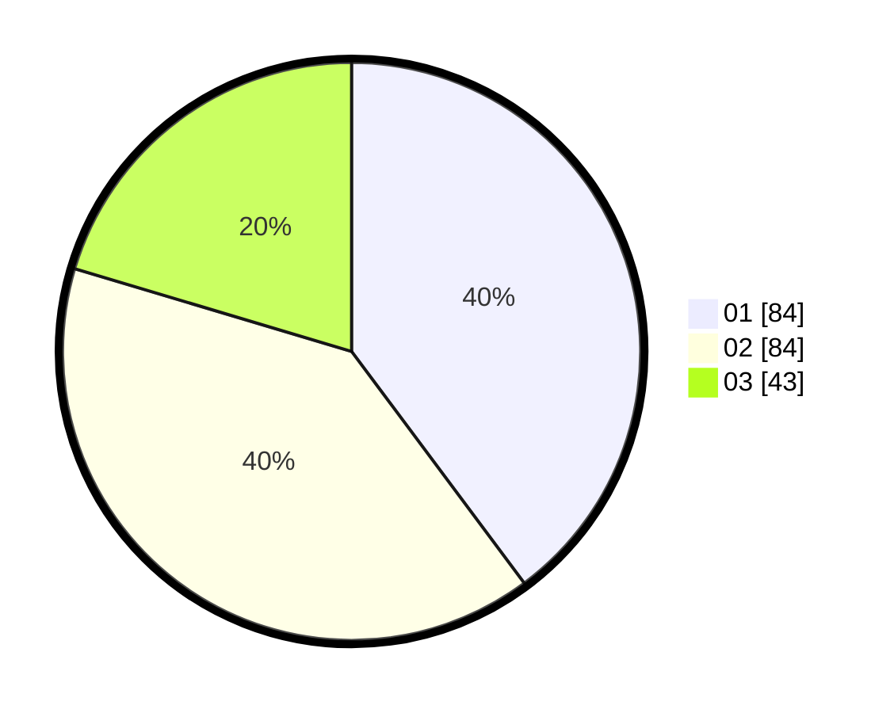

# Hasil

Hasil perolehan suara paslon dapat dilihat pada file paslon-01.txt, paslon-02.txt, dan paslon-03.txt.

Jika tidak ada, artinya data tersebut belum ada pada SIREKAP.

## Perolehan Suara

 * Paslon 01: **84**.
 * Paslon 02: **84**.
 * Paslon 03: **43**.

## Foto C Plano

https://sirekap-obj-formc.kpu.go.id/8409/pemilu/ppwp/31/73/05/10/07/3173051007020-20240217-201937--3ca16688-7fa5-418c-840b-726792ed735a.jpg

https://sirekap-obj-formc.kpu.go.id/8409/pemilu/ppwp/31/73/05/10/07/3173051007020-20240217-202020--56829155-8403-4e3d-a638-0bc52f775f1c.jpg

https://sirekap-obj-formc.kpu.go.id/8409/pemilu/ppwp/31/73/05/10/07/3173051007020-20240218-221133--dc23c2b7-56e9-456c-ac01-761c44515dc4.jpg

## DATA PEMILIH TETAP

Jumlah pemilih dalam DPT: **263**.
 * L: **131**.
 * P: **132**.

## DATA PENGGUNA HAK PILIH

Jumlah pengguna hak pilih dalam DPT: **213**.
 * L: **103**.
 * P: **110**.

Jumlah pengguna hak pilih dalam DPTb: **1**.
 * L: **1**.
 * P: **0**.

Jumlah pengguna hak pilih dalam DPK: **0**.
 * L: **0**.
 * P: **0**.

Jumlah pengguna hak pilih: **214**.
 * L: **104**.
 * P: **110**.

## JUMLAH SUARA SAH DAN TIDAK SAH

JUMLAH SELURUH SUARA SAH: **211**.

JUMLAH SUARA TIDAK SAH: **3**.

JUMLAH SELURUH SUARA SAH DAN SUARA TIDAK SAH: **214**.
