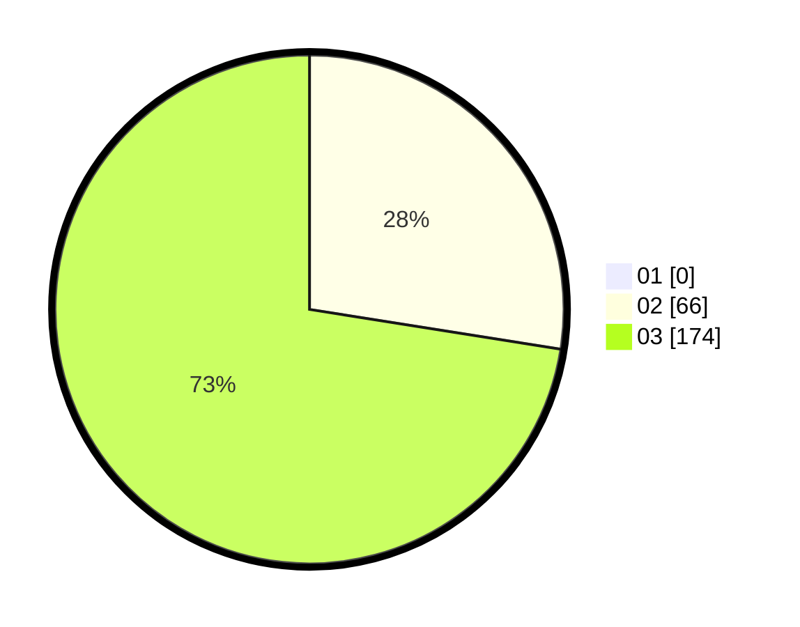

# Hasil

Hasil perolehan suara paslon dapat dilihat pada file paslon-01.txt, paslon-02.txt, dan paslon-03.txt.

Jika tidak ada, artinya data tersebut belum ada pada SIREKAP.

## Perolehan Suara

 * Paslon 01: **0**.
 * Paslon 02: **66**.
 * Paslon 03: **174**.

## Foto C Plano

https://sirekap-obj-formc.kpu.go.id/e832/pemilu/ppwp/31/73/05/10/07/3173051007023-20240214-191651--32c78105-fa9c-48a9-8d0e-6d3bd155c280.jpg

https://sirekap-obj-formc.kpu.go.id/e832/pemilu/ppwp/31/73/05/10/07/3173051007023-20240214-191659--9a960d35-71d1-4a04-a8d2-2997566d4943.jpg

https://sirekap-obj-formc.kpu.go.id/e832/pemilu/ppwp/31/73/05/10/07/3173051007023-20240214-191706--52d6d13b-0065-421b-baae-4fdcd6948f18.jpg
