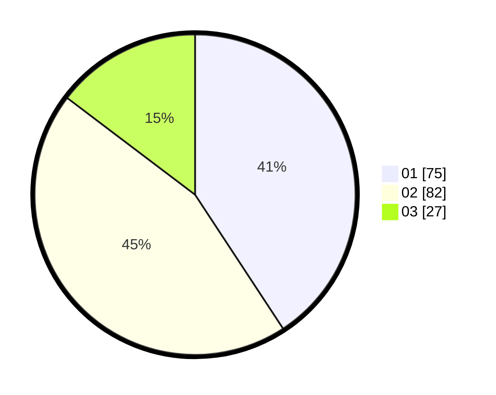

# Hasil

Hasil perolehan suara paslon dapat dilihat pada file paslon-01.txt, paslon-02.txt, dan paslon-03.txt.

Jika tidak ada, artinya data tersebut belum ada pada SIREKAP.

## Perolehan Suara

 * Paslon 01: **75**.
 * Paslon 02: **82**.
 * Paslon 03: **27**.

## Foto C Plano

https://sirekap-obj-formc.kpu.go.id/651b/pemilu/ppwp/31/73/05/10/07/3173051007030-20240216-210930--a391fc45-cd7b-4e55-8c24-615327d47876.jpg

https://sirekap-obj-formc.kpu.go.id/651b/pemilu/ppwp/31/73/05/10/07/3173051007030-20240214-214210--a28d0912-b7aa-4414-b341-13300cabd06a.jpg

https://sirekap-obj-formc.kpu.go.id/651b/pemilu/ppwp/31/73/05/10/07/3173051007030-20240214-214253--e4093356-0da4-4d2b-a76c-638c3eda7298.jpg

## DATA PEMILIH TETAP

Jumlah pemilih dalam DPT: **244**.
 * L: **113**.
 * P: **131**.

## DATA PENGGUNA HAK PILIH

Jumlah pengguna hak pilih dalam DPT: **177**.
 * L: **81**.
 * P: **96**.

Jumlah pengguna hak pilih dalam DPTb: **2**.
 * L: **2**.
 * P: **0**.

Jumlah pengguna hak pilih dalam DPK: **9**.
 * L: **5**.
 * P: **4**.

Jumlah pengguna hak pilih: **188**.
 * L: **88**.
 * P: **100**.

## JUMLAH SUARA SAH DAN TIDAK SAH

JUMLAH SELURUH SUARA SAH: **184**.

JUMLAH SUARA TIDAK SAH: **5**.

JUMLAH SELURUH SUARA SAH DAN SUARA TIDAK SAH: **189**.
