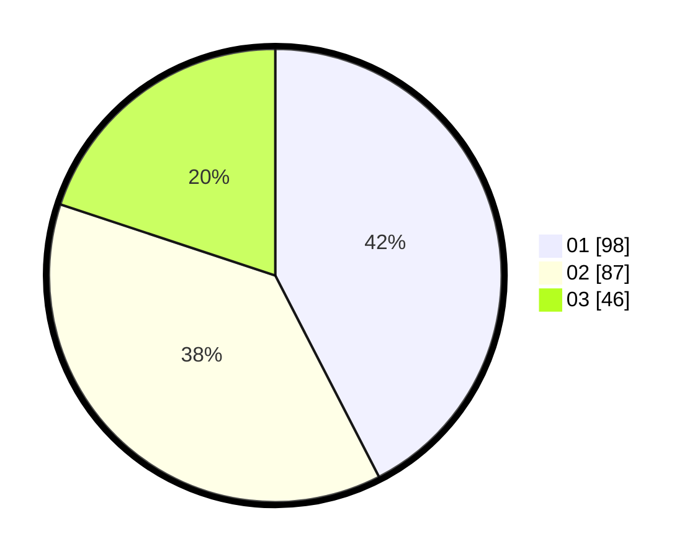

# Hasil

Hasil perolehan suara paslon dapat dilihat pada file paslon-01.txt, paslon-02.txt, dan paslon-03.txt.

Jika tidak ada, artinya data tersebut belum ada pada SIREKAP.

## Perolehan Suara

 * Paslon 01: **98**.
 * Paslon 02: **87**.
 * Paslon 03: **46**.

## Foto C Plano

https://sirekap-obj-formc.kpu.go.id/539b/pemilu/ppwp/31/73/05/10/07/3173051007033-20240215-030422--7a96c419-6e45-42b8-8699-c41faa1d677a.jpg

https://sirekap-obj-formc.kpu.go.id/539b/pemilu/ppwp/31/73/05/10/07/3173051007033-20240215-030440--eea681ca-eb7b-4a65-ab1f-8ecbcf255ca6.jpg

https://sirekap-obj-formc.kpu.go.id/539b/pemilu/ppwp/31/73/05/10/07/3173051007033-20240215-030500--773dcef2-1ada-40f1-9736-2519edf2dc8c.jpg

## DATA PEMILIH TETAP

Jumlah pemilih dalam DPT: **287**.
 * L: **151**.
 * P: **136**.

## DATA PENGGUNA HAK PILIH

Jumlah pengguna hak pilih dalam DPT: **224**.
 * L: **114**.
 * P: **110**.

Jumlah pengguna hak pilih dalam DPTb: **6**.
 * L: **4**.
 * P: **2**.

Jumlah pengguna hak pilih dalam DPK: **3**.
 * L: **2**.
 * P: **1**.

Jumlah pengguna hak pilih: **233**.
 * L: **120**.
 * P: **113**.

## JUMLAH SUARA SAH DAN TIDAK SAH

JUMLAH SELURUH SUARA SAH: **231**.

JUMLAH SUARA TIDAK SAH: **2**.

JUMLAH SELURUH SUARA SAH DAN SUARA TIDAK SAH: **233**.
