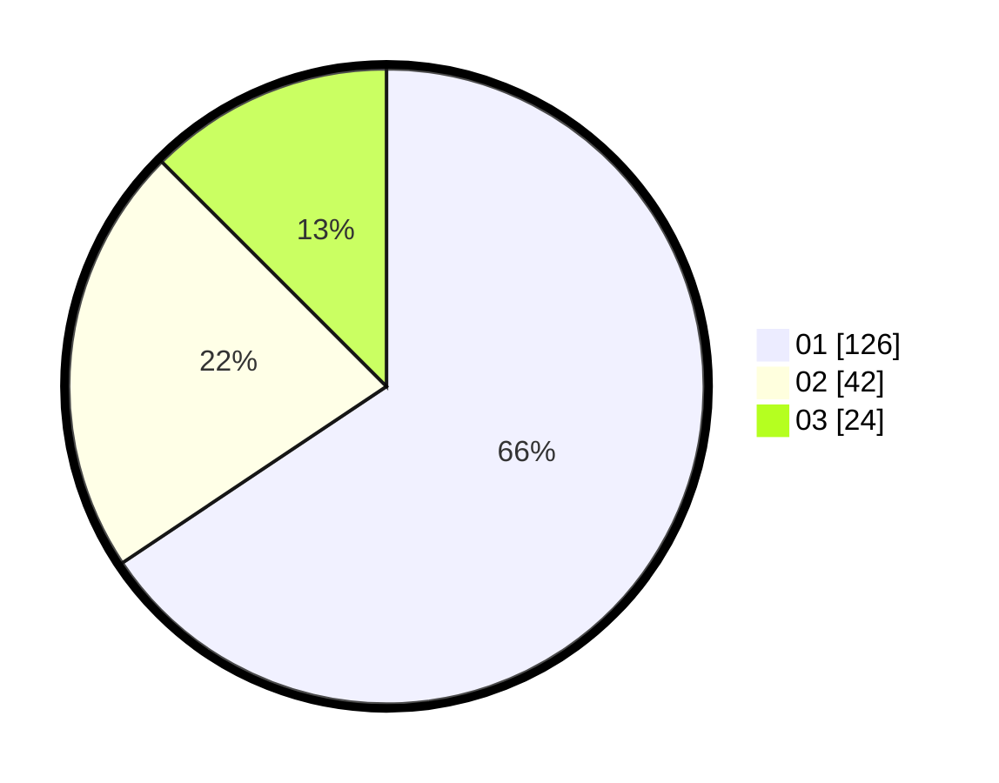

# Hasil

Hasil perolehan suara paslon dapat dilihat pada file paslon-01.txt, paslon-02.txt, dan paslon-03.txt.

Jika tidak ada, artinya data tersebut belum ada pada SIREKAP.

## Perolehan Suara

 * Paslon 01: **126**.
 * Paslon 02: **42**.
 * Paslon 03: **24**.

## Foto C Plano

https://sirekap-obj-formc.kpu.go.id/eff4/pemilu/ppwp/31/73/05/10/07/3173051007034-20240215-004607--18697b63-9990-4b5b-a9ab-d8e7e18f4e07.jpg

https://sirekap-obj-formc.kpu.go.id/eff4/pemilu/ppwp/31/73/05/10/07/3173051007034-20240215-004215--401b4293-387d-4302-b224-a39f9e594875.jpg

https://sirekap-obj-formc.kpu.go.id/eff4/pemilu/ppwp/31/73/05/10/07/3173051007034-20240216-163915--b8477aba-0fb3-4c4f-8893-0135ab92f6c6.jpg

## DATA PEMILIH TETAP

Jumlah pemilih dalam DPT: **222**.
 * L: **145**.
 * P: **137**.

## DATA PENGGUNA HAK PILIH

Jumlah pengguna hak pilih dalam DPT: **252**.
 * L: **123**.
 * P: **125**.

Jumlah pengguna hak pilih dalam DPTb: **1**.
 * L: **1**.
 * P: **0**.

Jumlah pengguna hak pilih dalam DPK: **5**.
 * L: **3**.
 * P: **2**.

Jumlah pengguna hak pilih: **250**.
 * L: **125**.
 * P: **124**.

## JUMLAH SUARA SAH DAN TIDAK SAH

JUMLAH SELURUH SUARA SAH: **247**.

JUMLAH SUARA TIDAK SAH: **3**.

JUMLAH SELURUH SUARA SAH DAN SUARA TIDAK SAH: **250**.
