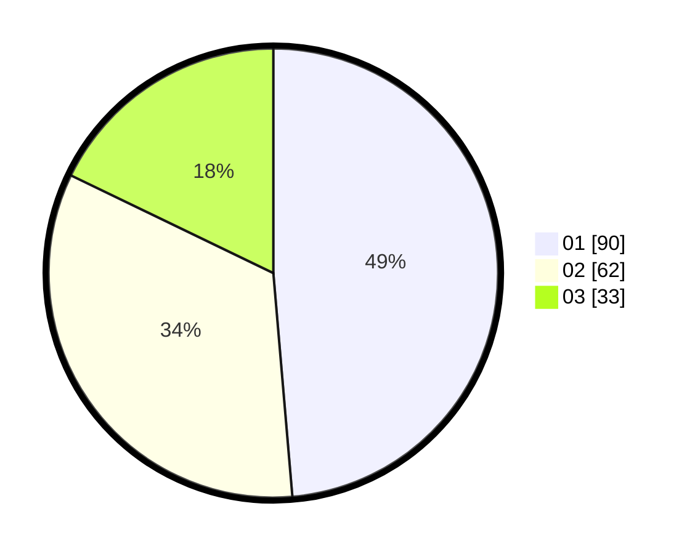

# Hasil

Hasil perolehan suara paslon dapat dilihat pada file paslon-01.txt, paslon-02.txt, dan paslon-03.txt.

Jika tidak ada, artinya data tersebut belum ada pada SIREKAP.

## Perolehan Suara

 * Paslon 01: **90**.
 * Paslon 02: **62**.
 * Paslon 03: **33**.

## Foto C Plano

https://sirekap-obj-formc.kpu.go.id/f500/pemilu/ppwp/31/73/05/10/07/3173051007036-20240216-153716--67b193c3-6ff8-4d17-9b38-4116fc4f9e12.jpg

https://sirekap-obj-formc.kpu.go.id/f500/pemilu/ppwp/31/73/05/10/07/3173051007036-20240214-200239--826efe07-8089-4f70-82c0-8a598610dff8.jpg

https://sirekap-obj-formc.kpu.go.id/f500/pemilu/ppwp/31/73/05/10/07/3173051007036-20240216-153717--e889121c-34bd-4800-99cf-5a50cbc77848.jpg

## DATA PEMILIH TETAP

Jumlah pemilih dalam DPT: **244**.
 * L: **128**.
 * P: **116**.

## DATA PENGGUNA HAK PILIH

Jumlah pengguna hak pilih dalam DPT: **185**.
 * L: **92**.
 * P: **93**.

Jumlah pengguna hak pilih dalam DPTb: **1**.
 * L: **0**.
 * P: **1**.

Jumlah pengguna hak pilih dalam DPK: **1**.
 * L: **0**.
 * P: **1**.

Jumlah pengguna hak pilih: **187**.
 * L: **92**.
 * P: **95**.

## JUMLAH SUARA SAH DAN TIDAK SAH

JUMLAH SELURUH SUARA SAH: **185**.

JUMLAH SUARA TIDAK SAH: **2**.

JUMLAH SELURUH SUARA SAH DAN SUARA TIDAK SAH: **187**.
