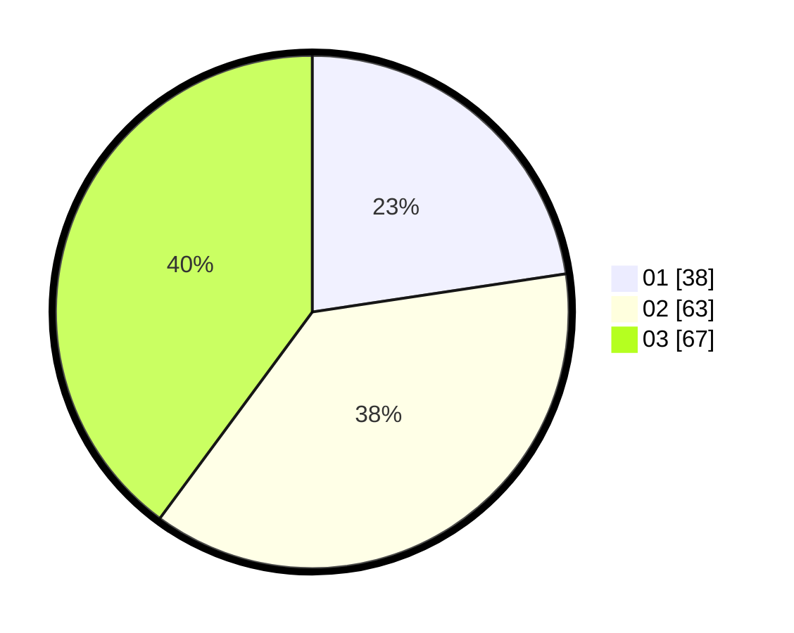

# Hasil

Hasil perolehan suara paslon dapat dilihat pada file paslon-01.txt, paslon-02.txt, dan paslon-03.txt.

Jika tidak ada, artinya data tersebut belum ada pada SIREKAP.

## Perolehan Suara

 * Paslon 01: **38**.
 * Paslon 02: **63**.
 * Paslon 03: **67**.

## Foto C Plano

https://sirekap-obj-formc.kpu.go.id/16c9/pemilu/ppwp/31/73/05/10/07/3173051007037-20240214-234039--ab637b8e-7d52-4a61-9c6f-70364cc1ce48.jpg

https://sirekap-obj-formc.kpu.go.id/16c9/pemilu/ppwp/31/73/05/10/07/3173051007037-20240214-234152--c03e1634-3d5d-43d0-9260-efb97ced9539.jpg

https://sirekap-obj-formc.kpu.go.id/16c9/pemilu/ppwp/31/73/05/10/07/3173051007037-20240214-234230--96d86dca-73f0-4af6-b22f-8dce1e07f95c.jpg

## DATA PEMILIH TETAP

Jumlah pemilih dalam DPT: **217**.
 * L: **103**.
 * P: **114**.

## DATA PENGGUNA HAK PILIH

Jumlah pengguna hak pilih dalam DPT: **164**.
 * L: **77**.
 * P: **87**.

Jumlah pengguna hak pilih dalam DPTb: **2**.
 * L: **2**.
 * P: **0**.

Jumlah pengguna hak pilih dalam DPK: **3**.
 * L: **3**.
 * P: **0**.

Jumlah pengguna hak pilih: **169**.
 * L: **82**.
 * P: **87**.

## JUMLAH SUARA SAH DAN TIDAK SAH

JUMLAH SELURUH SUARA SAH: **168**.

JUMLAH SUARA TIDAK SAH: **1**.

JUMLAH SELURUH SUARA SAH DAN SUARA TIDAK SAH: **169**.
