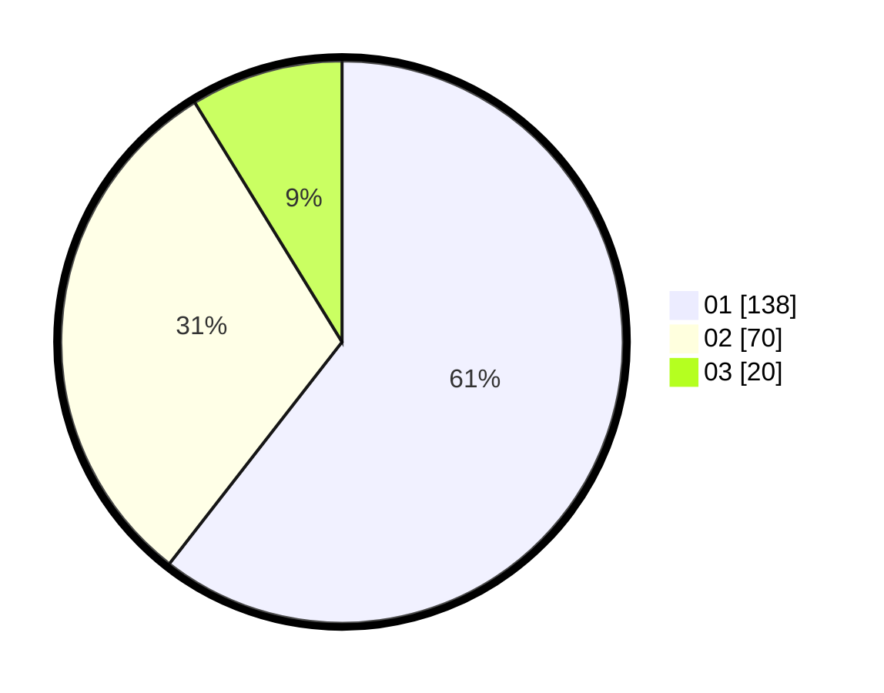

# Hasil

Hasil perolehan suara paslon dapat dilihat pada file paslon-01.txt, paslon-02.txt, dan paslon-03.txt.

Jika tidak ada, artinya data tersebut belum ada pada SIREKAP.

## Perolehan Suara

 * Paslon 01: **138**.
 * Paslon 02: **70**.
 * Paslon 03: **20**.

## Foto C Plano

https://sirekap-obj-formc.kpu.go.id/db9e/pemilu/ppwp/31/73/05/10/07/3173051007038-20240215-005346--e091fcf2-c5de-4b9f-8457-d968dd3613da.jpg

https://sirekap-obj-formc.kpu.go.id/db9e/pemilu/ppwp/31/73/05/10/07/3173051007038-20240215-005531--6cacabb4-650b-4c90-abf6-7fec3fe6daec.jpg

https://sirekap-obj-formc.kpu.go.id/db9e/pemilu/ppwp/31/73/05/10/07/3173051007038-20240215-005606--9f5ff0ea-f313-4ac6-9f75-263a2bb34f15.jpg
