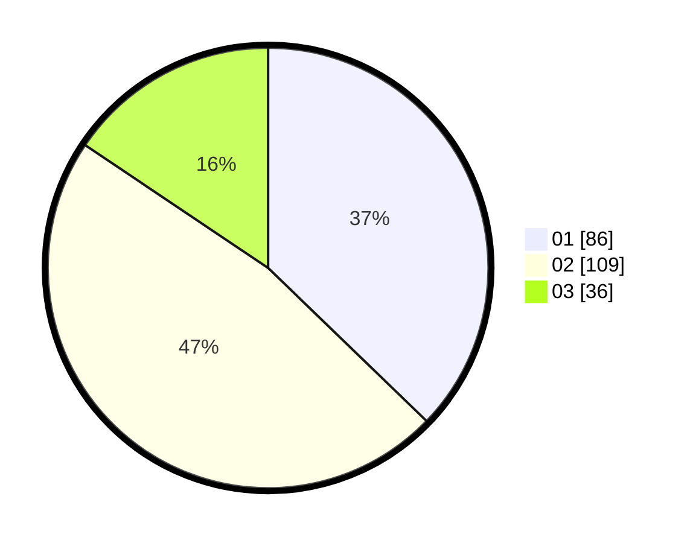

# Hasil

Hasil perolehan suara paslon dapat dilihat pada file paslon-01.txt, paslon-02.txt, dan paslon-03.txt.

Jika tidak ada, artinya data tersebut belum ada pada SIREKAP.

## Perolehan Suara

 * Paslon 01: **86**.
 * Paslon 02: **109**.
 * Paslon 03: **36**.

## Foto C Plano

https://sirekap-obj-formc.kpu.go.id/6670/pemilu/ppwp/31/73/05/10/07/3173051007040-20240214-184548--bf42cbed-68b0-47ea-8b3c-cc840b51ade5.jpg

https://sirekap-obj-formc.kpu.go.id/6670/pemilu/ppwp/31/73/05/10/07/3173051007040-20240214-184610--539a363d-c0fc-4efb-b0c9-926ee98e20c5.jpg

https://sirekap-obj-formc.kpu.go.id/6670/pemilu/ppwp/31/73/05/10/07/3173051007040-20240214-184559--ef6f8b0b-14b1-4af0-8862-42c0070a25d8.jpg

## DATA PEMILIH TETAP

Jumlah pemilih dalam DPT: **285**.
 * L: **149**.
 * P: **136**.

## DATA PENGGUNA HAK PILIH

Jumlah pengguna hak pilih dalam DPT: **228**.
 * L: **118**.
 * P: **110**.

Jumlah pengguna hak pilih dalam DPTb: **9**.
 * L: **0**.
 * P: **9**.

Jumlah pengguna hak pilih dalam DPK: **3**.
 * L: **1**.
 * P: **2**.

Jumlah pengguna hak pilih: **240**.
 * L: **119**.
 * P: **121**.

## JUMLAH SUARA SAH DAN TIDAK SAH

JUMLAH SELURUH SUARA SAH: **231**.

JUMLAH SUARA TIDAK SAH: **7**.

JUMLAH SELURUH SUARA SAH DAN SUARA TIDAK SAH: **238**.
