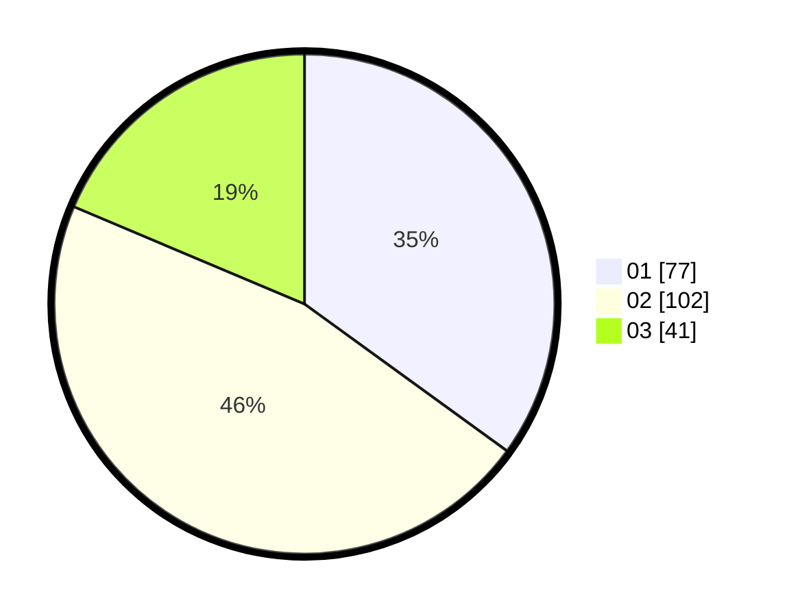

# Hasil

Hasil perolehan suara paslon dapat dilihat pada file paslon-01.txt, paslon-02.txt, dan paslon-03.txt.

Jika tidak ada, artinya data tersebut belum ada pada SIREKAP.

## Perolehan Suara

 * Paslon 01: **77**.
 * Paslon 02: **102**.
 * Paslon 03: **41**.

## Foto C Plano

https://sirekap-obj-formc.kpu.go.id/bff6/pemilu/ppwp/31/73/05/10/07/3173051007042-20240214-225558--76f76d19-ce49-44b2-bbcb-d2f896935ef5.jpg

https://sirekap-obj-formc.kpu.go.id/bff6/pemilu/ppwp/31/73/05/10/07/3173051007042-20240214-213606--a08e5093-d39b-4498-82c3-16cf0b9a3278.jpg

https://sirekap-obj-formc.kpu.go.id/bff6/pemilu/ppwp/31/73/05/10/07/3173051007042-20240214-213708--b182e5a0-c2fb-4080-9dd5-c3babb954dbe.jpg
