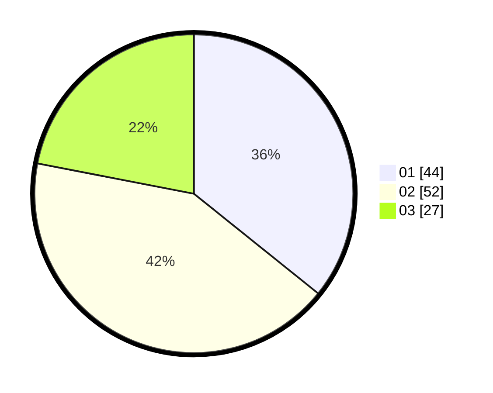

# Hasil

Hasil perolehan suara paslon dapat dilihat pada file paslon-01.txt, paslon-02.txt, dan paslon-03.txt.

Jika tidak ada, artinya data tersebut belum ada pada SIREKAP.

## Perolehan Suara

 * Paslon 01: **44**.
 * Paslon 02: **52**.
 * Paslon 03: **27**.

## Foto C Plano

https://sirekap-obj-formc.kpu.go.id/fe6a/pemilu/ppwp/31/73/05/10/07/3173051007045-20240214-155218--58a5b2b3-2c6c-448a-b78f-5fabf6140122.jpg

https://sirekap-obj-formc.kpu.go.id/fe6a/pemilu/ppwp/31/73/05/10/07/3173051007045-20240214-155549--df2753dc-8086-4a6d-91b9-b828a288b179.jpg

https://sirekap-obj-formc.kpu.go.id/fe6a/pemilu/ppwp/31/73/05/10/07/3173051007045-20240214-155741--c031e216-22dd-4354-b6a9-47c46acb15b2.jpg

## DATA PEMILIH TETAP

Jumlah pemilih dalam DPT: **153**.
 * L: **81**.
 * P: **72**.

## DATA PENGGUNA HAK PILIH

Jumlah pengguna hak pilih dalam DPT: **123**.
 * L: **60**.
 * P: **63**.

Jumlah pengguna hak pilih dalam DPTb: **0**.
 * L: **0**.
 * P: **0**.

Jumlah pengguna hak pilih dalam DPK: **1**.
 * L: **1**.
 * P: **0**.

Jumlah pengguna hak pilih: **124**.
 * L: **61**.
 * P: **63**.

## JUMLAH SUARA SAH DAN TIDAK SAH

JUMLAH SELURUH SUARA SAH: **123**.

JUMLAH SUARA TIDAK SAH: **1**.

JUMLAH SELURUH SUARA SAH DAN SUARA TIDAK SAH: **124**.
