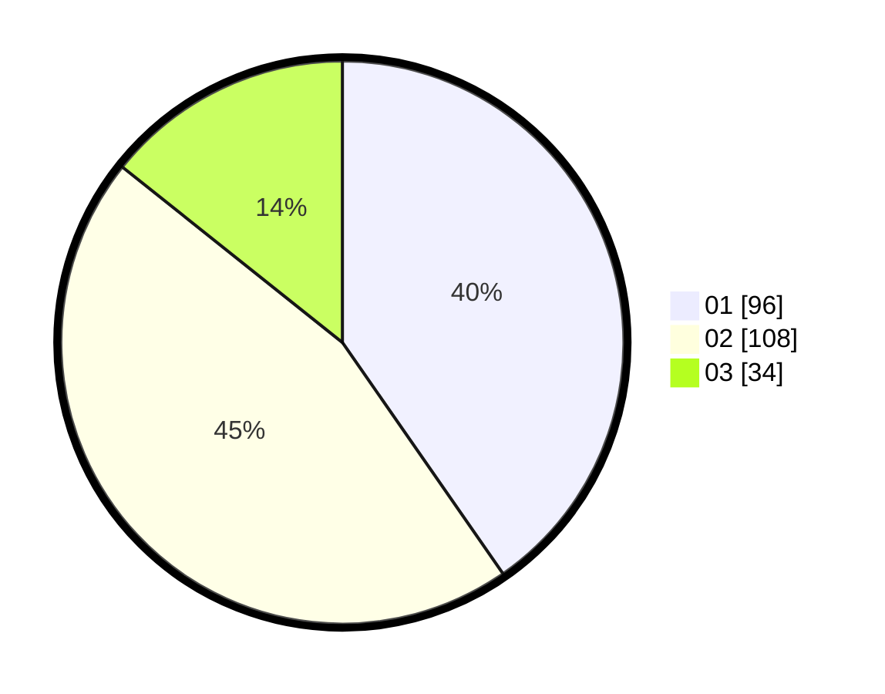

# Hasil

Hasil perolehan suara paslon dapat dilihat pada file paslon-01.txt, paslon-02.txt, dan paslon-03.txt.

Jika tidak ada, artinya data tersebut belum ada pada SIREKAP.

## Perolehan Suara

 * Paslon 01: **96**.
 * Paslon 02: **108**.
 * Paslon 03: **34**.

## Foto C Plano

https://sirekap-obj-formc.kpu.go.id/8e32/pemilu/ppwp/31/73/05/10/07/3173051007051-20240218-205706--3e4e4a3c-a3d9-4605-8ac4-53cc33c38707.jpg

https://sirekap-obj-formc.kpu.go.id/8e32/pemilu/ppwp/31/73/05/10/07/3173051007051-20240218-205707--812cd836-812d-44ba-8a8a-74cdab56c193.jpg

https://sirekap-obj-formc.kpu.go.id/8e32/pemilu/ppwp/31/73/05/10/07/3173051007051-20240218-205706--b5de4918-b0aa-4785-a717-b3af0765e2e8.jpg

## DATA PEMILIH TETAP

Jumlah pemilih dalam DPT: **287**.
 * L: **128**.
 * P: **159**.

## DATA PENGGUNA HAK PILIH

Jumlah pengguna hak pilih dalam DPT: **209**.
 * L: **87**.
 * P: **122**.

Jumlah pengguna hak pilih dalam DPTb: **17**.
 * L: **7**.
 * P: **10**.

Jumlah pengguna hak pilih dalam DPK: **6**.
 * L: **3**.
 * P: **3**.

Jumlah pengguna hak pilih: **232**.
 * L: **97**.
 * P: **135**.

## JUMLAH SUARA SAH DAN TIDAK SAH

JUMLAH SELURUH SUARA SAH: **0**.

JUMLAH SUARA TIDAK SAH: **0**.

JUMLAH SELURUH SUARA SAH DAN SUARA TIDAK SAH: **0**.
