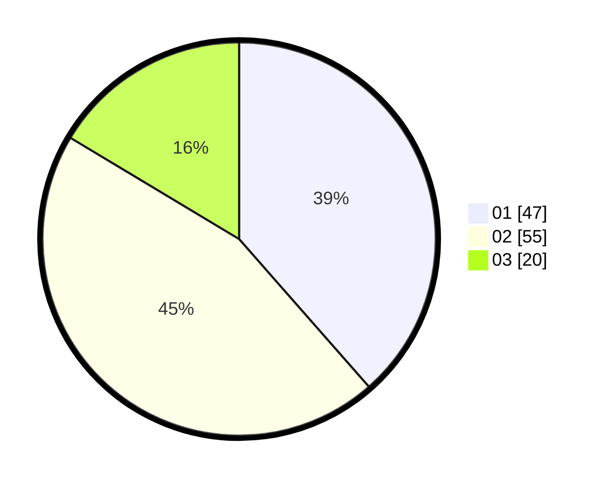

# Hasil

Hasil perolehan suara paslon dapat dilihat pada file paslon-01.txt, paslon-02.txt, dan paslon-03.txt.

Jika tidak ada, artinya data tersebut belum ada pada SIREKAP.

## Perolehan Suara

 * Paslon 01: **47**.
 * Paslon 02: **55**.
 * Paslon 03: **20**.

## Foto C Plano

https://sirekap-obj-formc.kpu.go.id/27b4/pemilu/ppwp/31/73/05/10/07/3173051007052-20240216-023911--42c9fc05-8f50-44ba-886b-604e6fb18f62.jpg

https://sirekap-obj-formc.kpu.go.id/27b4/pemilu/ppwp/31/73/05/10/07/3173051007052-20240216-023912--3b625fd8-ff94-4091-afbe-b09fa3f45bd0.jpg

https://sirekap-obj-formc.kpu.go.id/27b4/pemilu/ppwp/31/73/05/10/07/3173051007052-20240216-023911--2b27563a-2a01-4a02-9edf-eaba3182d3b4.jpg

## DATA PEMILIH TETAP

Jumlah pemilih dalam DPT: **157**.
 * L: **77**.
 * P: **80**.

## DATA PENGGUNA HAK PILIH

Jumlah pengguna hak pilih dalam DPT: **119**.
 * L: **54**.
 * P: **65**.

Jumlah pengguna hak pilih dalam DPTb: **6**.
 * L: **6**.
 * P: **0**.

Jumlah pengguna hak pilih dalam DPK: **0**.
 * L: **0**.
 * P: **0**.

Jumlah pengguna hak pilih: **125**.
 * L: **60**.
 * P: **65**.

## JUMLAH SUARA SAH DAN TIDAK SAH

JUMLAH SELURUH SUARA SAH: **122**.

JUMLAH SUARA TIDAK SAH: **3**.

JUMLAH SELURUH SUARA SAH DAN SUARA TIDAK SAH: **125**.
