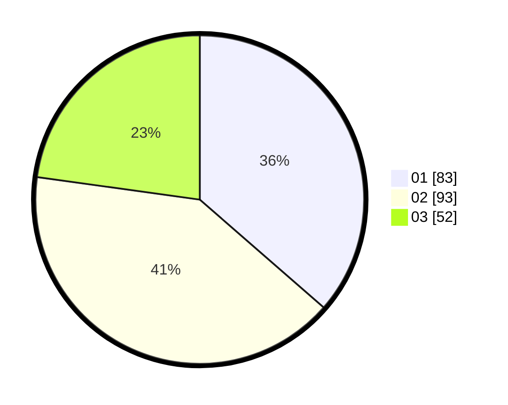

# Hasil

Hasil perolehan suara paslon dapat dilihat pada file paslon-01.txt, paslon-02.txt, dan paslon-03.txt.

Jika tidak ada, artinya data tersebut belum ada pada SIREKAP.

## Perolehan Suara

 * Paslon 01: **83**.
 * Paslon 02: **93**.
 * Paslon 03: **52**.

## Foto C Plano

https://sirekap-obj-formc.kpu.go.id/9769/pemilu/ppwp/31/73/05/10/07/3173051007056-20240214-230231--ce12a6c3-0979-4836-932c-f029f233b2ee.jpg

https://sirekap-obj-formc.kpu.go.id/9769/pemilu/ppwp/31/73/05/10/07/3173051007056-20240214-234423--8311f18b-c3df-457c-8a11-99d2f877677b.jpg

https://sirekap-obj-formc.kpu.go.id/9769/pemilu/ppwp/31/73/05/10/07/3173051007056-20240214-223905--af499870-abda-466a-ae1d-28d4ff4e4ffa.jpg
