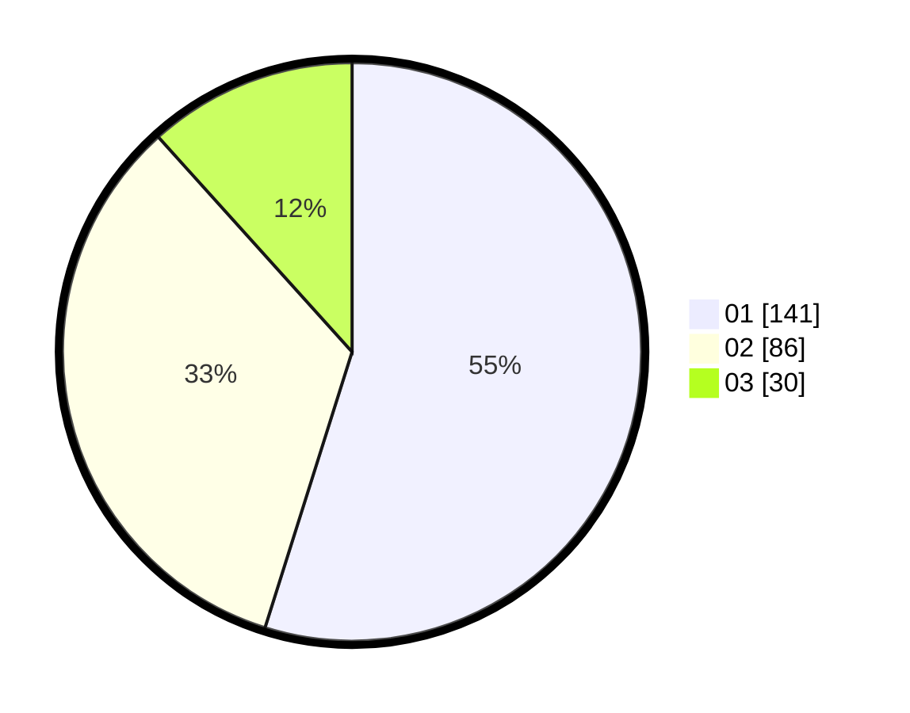

# Hasil

Hasil perolehan suara paslon dapat dilihat pada file paslon-01.txt, paslon-02.txt, dan paslon-03.txt.

Jika tidak ada, artinya data tersebut belum ada pada SIREKAP.

## Perolehan Suara

 * Paslon 01: **141**.
 * Paslon 02: **86**.
 * Paslon 03: **30**.

## Foto C Plano

https://sirekap-obj-formc.kpu.go.id/0756/pemilu/ppwp/31/73/05/10/07/3173051007059-20240218-185542--bc36b987-b29e-4354-8d3b-72cad8fa75ee.jpg

https://sirekap-obj-formc.kpu.go.id/0756/pemilu/ppwp/31/73/05/10/07/3173051007059-20240215-042557--eb3417cd-79fc-4ed8-b46b-bbeef7bb4117.jpg

https://sirekap-obj-formc.kpu.go.id/0756/pemilu/ppwp/31/73/05/10/07/3173051007059-20240215-053003--b55254f2-7ce2-4069-b27d-9e2d8964df8d.jpg
