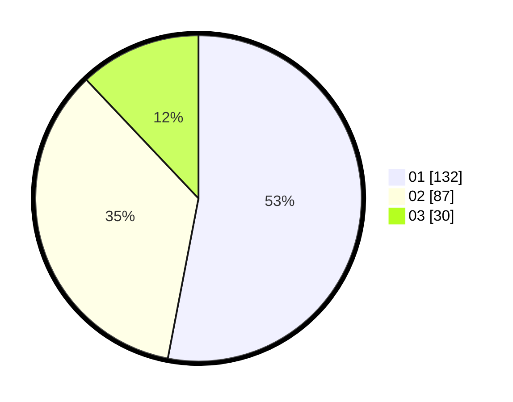

# Hasil

Hasil perolehan suara paslon dapat dilihat pada file paslon-01.txt, paslon-02.txt, dan paslon-03.txt.

Jika tidak ada, artinya data tersebut belum ada pada SIREKAP.

## Perolehan Suara

 * Paslon 01: **132**.
 * Paslon 02: **87**.
 * Paslon 03: **30**.

## Foto C Plano

https://sirekap-obj-formc.kpu.go.id/fd26/pemilu/ppwp/31/73/05/10/07/3173051007061-20240215-000002--f41a57e7-9164-46bc-90dc-7d5bc5bf7dd2.jpg

https://sirekap-obj-formc.kpu.go.id/fd26/pemilu/ppwp/31/73/05/10/07/3173051007061-20240215-000110--ea08d90e-6d27-45bb-a89e-e34c48515038.jpg

https://sirekap-obj-formc.kpu.go.id/fd26/pemilu/ppwp/31/73/05/10/07/3173051007061-20240214-202830--6fe89341-df98-4d2f-8f8e-f9b5010e0f82.jpg

## DATA PEMILIH TETAP

Jumlah pemilih dalam DPT: **282**.
 * L: **129**.
 * P: **153**.

## DATA PENGGUNA HAK PILIH

Jumlah pengguna hak pilih dalam DPT: **234**.
 * L: **112**.
 * P: **122**.

Jumlah pengguna hak pilih dalam DPTb: **16**.
 * L: **10**.
 * P: **6**.

Jumlah pengguna hak pilih dalam DPK: **2**.
 * L: **2**.
 * P: **0**.

Jumlah pengguna hak pilih: **252**.
 * L: **124**.
 * P: **128**.

## JUMLAH SUARA SAH DAN TIDAK SAH

JUMLAH SELURUH SUARA SAH: **249**.

JUMLAH SUARA TIDAK SAH: **3**.

JUMLAH SELURUH SUARA SAH DAN SUARA TIDAK SAH: **252**.
