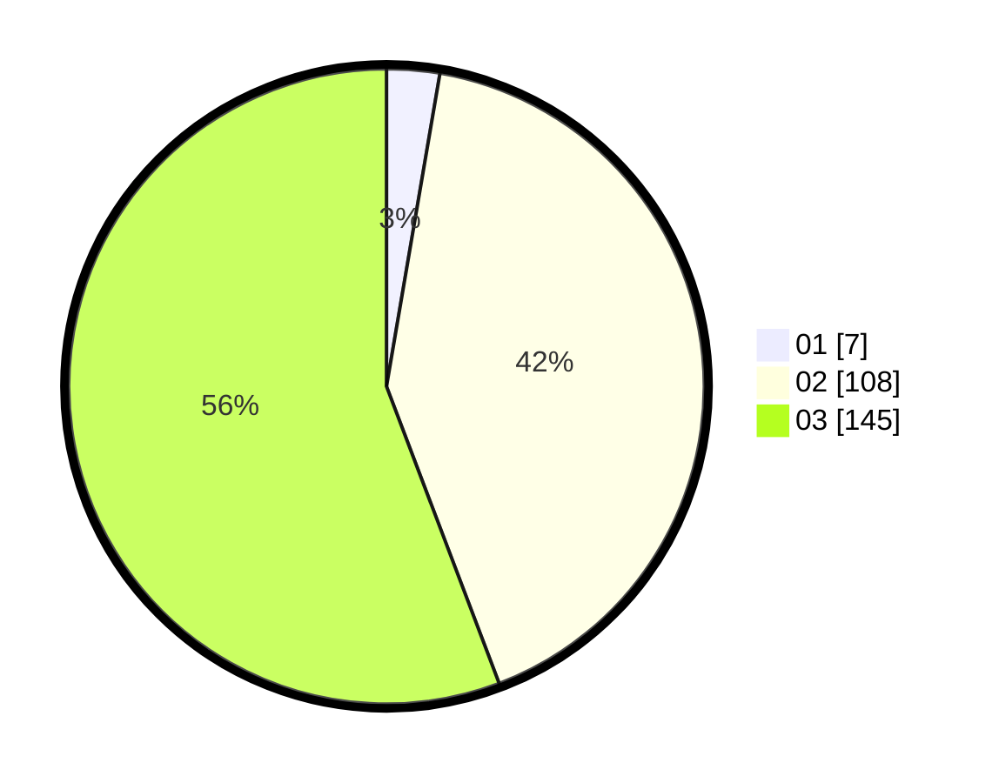

# Hasil

Hasil perolehan suara paslon dapat dilihat pada file paslon-01.txt, paslon-02.txt, dan paslon-03.txt.

Jika tidak ada, artinya data tersebut belum ada pada SIREKAP.

## Perolehan Suara

 * Paslon 01: **7**.
 * Paslon 02: **108**.
 * Paslon 03: **145**.

## Foto C Plano

https://sirekap-obj-formc.kpu.go.id/6dd5/pemilu/ppwp/31/73/05/10/07/3173051007066-20240214-230835--a0bda8a4-de1d-43ce-b271-7526c75a3ce7.jpg

https://sirekap-obj-formc.kpu.go.id/6dd5/pemilu/ppwp/31/73/05/10/07/3173051007066-20240214-231045--fcde2065-9373-4c00-9956-95f341cacd88.jpg

https://sirekap-obj-formc.kpu.go.id/6dd5/pemilu/ppwp/31/73/05/10/07/3173051007066-20240214-231126--5676435f-1ce9-4e84-b560-4fc2f4facd54.jpg
