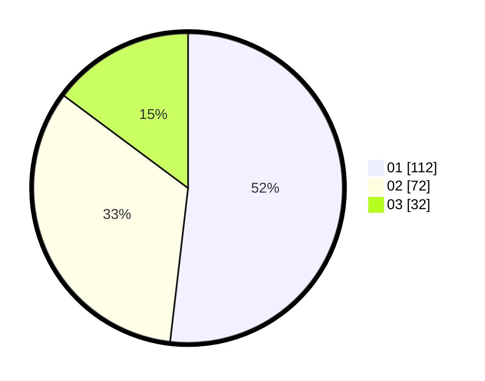

# Hasil

Hasil perolehan suara paslon dapat dilihat pada file paslon-01.txt, paslon-02.txt, dan paslon-03.txt.

Jika tidak ada, artinya data tersebut belum ada pada SIREKAP.

## Perolehan Suara

 * Paslon 01: **112**.
 * Paslon 02: **72**.
 * Paslon 03: **32**.

## Foto C Plano

https://sirekap-obj-formc.kpu.go.id/b2b4/pemilu/ppwp/31/73/05/10/07/3173051007067-20240214-204216--41abbe49-34b8-474b-b7d6-059ba1b78510.jpg

https://sirekap-obj-formc.kpu.go.id/b2b4/pemilu/ppwp/31/73/05/10/07/3173051007067-20240214-194326--3458ef84-d35b-44b3-9854-8bb88e2ec089.jpg

https://sirekap-obj-formc.kpu.go.id/b2b4/pemilu/ppwp/31/73/05/10/07/3173051007067-20240214-204310--bfc1869b-52bf-4e62-a1b1-9293bd99463c.jpg
