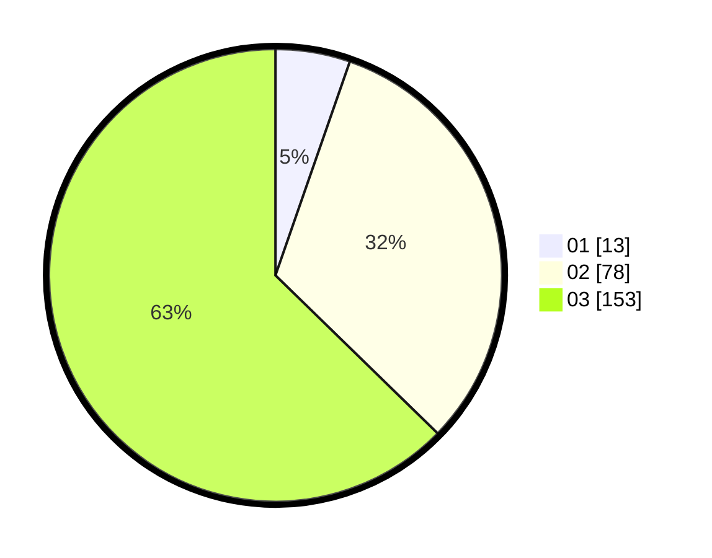

# Hasil

Hasil perolehan suara paslon dapat dilihat pada file paslon-01.txt, paslon-02.txt, dan paslon-03.txt.

Jika tidak ada, artinya data tersebut belum ada pada SIREKAP.

## Perolehan Suara

 * Paslon 01: **13**.
 * Paslon 02: **78**.
 * Paslon 03: **153**.

## Foto C Plano

https://sirekap-obj-formc.kpu.go.id/0b9f/pemilu/ppwp/31/73/05/10/07/3173051007071-20240215-214625--c5285225-65d1-4dea-b2cf-4c18adb23b1a.jpg

https://sirekap-obj-formc.kpu.go.id/0b9f/pemilu/ppwp/31/73/05/10/07/3173051007071-20240215-214628--5bd80683-fe14-409a-b23b-a19643de5b9a.jpg

https://sirekap-obj-formc.kpu.go.id/0b9f/pemilu/ppwp/31/73/05/10/07/3173051007071-20240215-214627--b574389e-30d4-4f86-93e4-5d4eab1d8fec.jpg

## DATA PEMILIH TETAP

Jumlah pemilih dalam DPT: **287**.
 * L: **135**.
 * P: **152**.

## DATA PENGGUNA HAK PILIH

Jumlah pengguna hak pilih dalam DPT: **229**.
 * L: **106**.
 * P: **123**.

Jumlah pengguna hak pilih dalam DPTb: **11**.
 * L: **2**.
 * P: **9**.

Jumlah pengguna hak pilih dalam DPK: **7**.
 * L: **2**.
 * P: **5**.

Jumlah pengguna hak pilih: **247**.
 * L: **110**.
 * P: **137**.

## JUMLAH SUARA SAH DAN TIDAK SAH

JUMLAH SELURUH SUARA SAH: **244**.

JUMLAH SUARA TIDAK SAH: **3**.

JUMLAH SELURUH SUARA SAH DAN SUARA TIDAK SAH: **247**.
