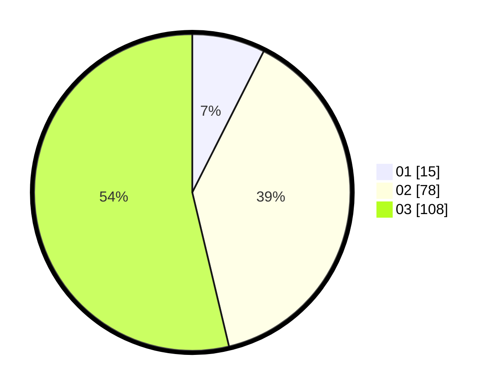

# Hasil

Hasil perolehan suara paslon dapat dilihat pada file paslon-01.txt, paslon-02.txt, dan paslon-03.txt.

Jika tidak ada, artinya data tersebut belum ada pada SIREKAP.

## Perolehan Suara

 * Paslon 01: **15**.
 * Paslon 02: **78**.
 * Paslon 03: **108**.

## Foto C Plano

https://sirekap-obj-formc.kpu.go.id/43a2/pemilu/ppwp/31/73/05/10/07/3173051007074-20240214-155926--1c8c5b18-49df-4193-ba16-199199b61258.jpg

https://sirekap-obj-formc.kpu.go.id/43a2/pemilu/ppwp/31/73/05/10/07/3173051007074-20240214-160056--1f932079-5d33-471e-be1e-eb3c9b6a3769.jpg

https://sirekap-obj-formc.kpu.go.id/43a2/pemilu/ppwp/31/73/05/10/07/3173051007074-20240214-160136--cf02f171-8c36-4423-a5a9-28f51588a2e1.jpg
