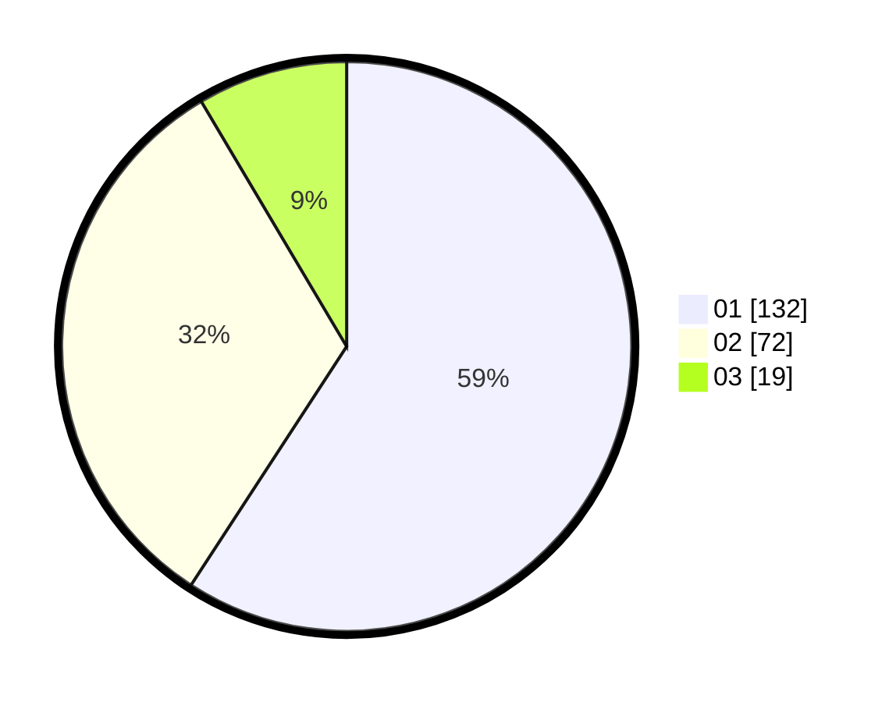

# Hasil

Hasil perolehan suara paslon dapat dilihat pada file paslon-01.txt, paslon-02.txt, dan paslon-03.txt.

Jika tidak ada, artinya data tersebut belum ada pada SIREKAP.

## Perolehan Suara

 * Paslon 01: **132**.
 * Paslon 02: **72**.
 * Paslon 03: **19**.

## Foto C Plano

https://sirekap-obj-formc.kpu.go.id/2570/pemilu/ppwp/31/73/05/10/07/3173051007076-20240217-185620--97267154-20da-4838-a9cd-7ab78ecfd5d0.jpg

https://sirekap-obj-formc.kpu.go.id/2570/pemilu/ppwp/31/73/05/10/07/3173051007076-20240217-185052--4696c23e-a521-4cd7-b149-33e57dfe9136.jpg

https://sirekap-obj-formc.kpu.go.id/2570/pemilu/ppwp/31/73/05/10/07/3173051007076-20240217-185751--77e26511-4e12-472f-a676-2e9e8d576f22.jpg
