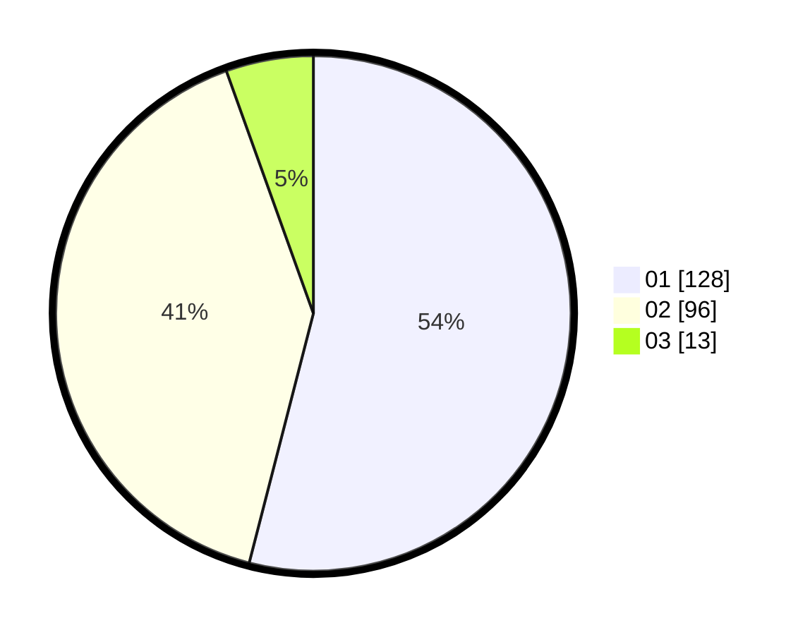

# Hasil

Hasil perolehan suara paslon dapat dilihat pada file paslon-01.txt, paslon-02.txt, dan paslon-03.txt.

Jika tidak ada, artinya data tersebut belum ada pada SIREKAP.

## Perolehan Suara

 * Paslon 01: **128**.
 * Paslon 02: **96**.
 * Paslon 03: **13**.

## Foto C Plano

https://sirekap-obj-formc.kpu.go.id/565e/pemilu/ppwp/31/73/05/10/07/3173051007077-20240214-234837--cf97b6c1-5803-41cf-8b90-077983a088a7.jpg

https://sirekap-obj-formc.kpu.go.id/565e/pemilu/ppwp/31/73/05/10/07/3173051007077-20240214-235033--5c818212-0535-4aec-a6bc-0183ceb873fd.jpg

https://sirekap-obj-formc.kpu.go.id/565e/pemilu/ppwp/31/73/05/10/07/3173051007077-20240214-231825--ae8acf91-a39a-444b-9834-787578cc9d11.jpg
