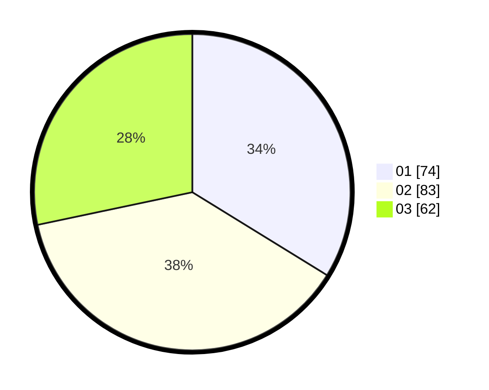

# Hasil

Hasil perolehan suara paslon dapat dilihat pada file paslon-01.txt, paslon-02.txt, dan paslon-03.txt.

Jika tidak ada, artinya data tersebut belum ada pada SIREKAP.

## Perolehan Suara

 * Paslon 01: **74**.
 * Paslon 02: **83**.
 * Paslon 03: **62**.

## Foto C Plano

https://sirekap-obj-formc.kpu.go.id/ee80/pemilu/ppwp/31/73/05/10/07/3173051007079-20240218-230813--3c3c6e74-651e-4afd-9c68-ff4f9260c522.jpg

https://sirekap-obj-formc.kpu.go.id/ee80/pemilu/ppwp/31/73/05/10/07/3173051007079-20240218-230815--b9c4617d-7a8a-4259-8c3b-2d395fd00c1f.jpg

https://sirekap-obj-formc.kpu.go.id/ee80/pemilu/ppwp/31/73/05/10/07/3173051007079-20240218-230814--b122eb1e-8cf4-4d48-975e-5ca2f8db3799.jpg

## DATA PEMILIH TETAP

Jumlah pemilih dalam DPT: **286**.
 * L: **157**.
 * P: **129**.

## DATA PENGGUNA HAK PILIH

Jumlah pengguna hak pilih dalam DPT: **224**.
 * L: **117**.
 * P: **107**.

Jumlah pengguna hak pilih dalam DPTb: **0**.
 * L: **0**.
 * P: **0**.

Jumlah pengguna hak pilih dalam DPK: **0**.
 * L: **0**.
 * P: **0**.

Jumlah pengguna hak pilih: **224**.
 * L: **117**.
 * P: **107**.

## JUMLAH SUARA SAH DAN TIDAK SAH

JUMLAH SELURUH SUARA SAH: **219**.

JUMLAH SUARA TIDAK SAH: **5**.

JUMLAH SELURUH SUARA SAH DAN SUARA TIDAK SAH: **224**.
