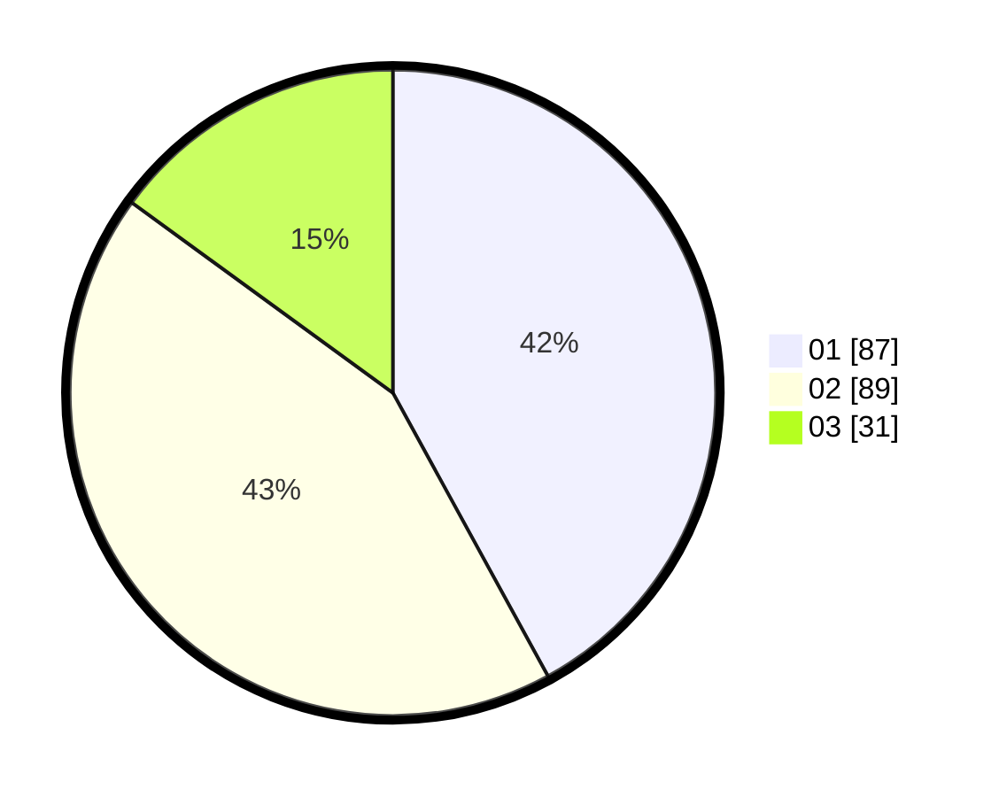

# Hasil

Hasil perolehan suara paslon dapat dilihat pada file paslon-01.txt, paslon-02.txt, dan paslon-03.txt.

Jika tidak ada, artinya data tersebut belum ada pada SIREKAP.

## Perolehan Suara

 * Paslon 01: **87**.
 * Paslon 02: **89**.
 * Paslon 03: **31**.

## Foto C Plano

https://sirekap-obj-formc.kpu.go.id/54b5/pemilu/ppwp/31/73/05/10/07/3173051007080-20240216-020816--2f5bfa4f-989e-4cbb-979a-a274da73e2fa.jpg

https://sirekap-obj-formc.kpu.go.id/54b5/pemilu/ppwp/31/73/05/10/07/3173051007080-20240216-020819--ea64ebec-11b5-458a-97eb-d55d9b8afc7f.jpg

https://sirekap-obj-formc.kpu.go.id/54b5/pemilu/ppwp/31/73/05/10/07/3173051007080-20240216-020817--3a5ed80d-fa8d-40ba-a4fc-8fc5ad9883eb.jpg

## DATA PEMILIH TETAP

Jumlah pemilih dalam DPT: **284**.
 * L: **139**.
 * P: **145**.

## DATA PENGGUNA HAK PILIH

Jumlah pengguna hak pilih dalam DPT: **208**.
 * L: **100**.
 * P: **108**.

Jumlah pengguna hak pilih dalam DPTb: **1**.
 * L: **0**.
 * P: **1**.

Jumlah pengguna hak pilih dalam DPK: **0**.
 * L: **0**.
 * P: **0**.

Jumlah pengguna hak pilih: **209**.
 * L: **100**.
 * P: **109**.

## JUMLAH SUARA SAH DAN TIDAK SAH

JUMLAH SELURUH SUARA SAH: **207**.

JUMLAH SUARA TIDAK SAH: **2**.

JUMLAH SELURUH SUARA SAH DAN SUARA TIDAK SAH: **209**.
