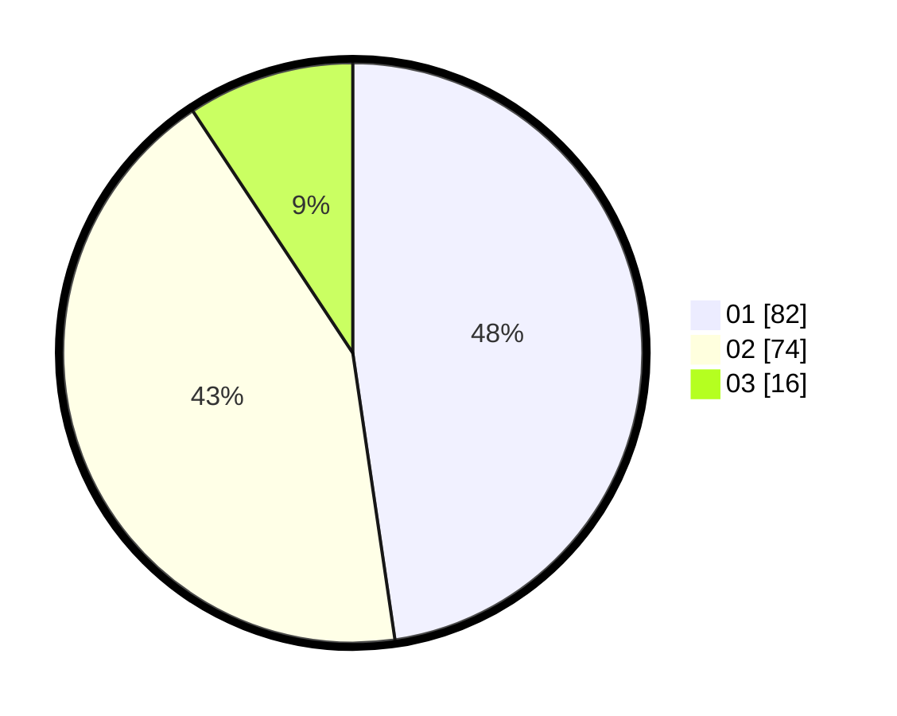

# Hasil

Hasil perolehan suara paslon dapat dilihat pada file paslon-01.txt, paslon-02.txt, dan paslon-03.txt.

Jika tidak ada, artinya data tersebut belum ada pada SIREKAP.

## Perolehan Suara

 * Paslon 01: **82**.
 * Paslon 02: **74**.
 * Paslon 03: **16**.

## Foto C Plano

https://sirekap-obj-formc.kpu.go.id/ba8f/pemilu/ppwp/31/73/05/10/07/3173051007087-20240214-155813--5f1552e8-b37c-41b8-9317-5c3f7c7a57f6.jpg

https://sirekap-obj-formc.kpu.go.id/ba8f/pemilu/ppwp/31/73/05/10/07/3173051007087-20240214-155921--72a2e039-98f0-4252-8f79-5dbdef847121.jpg

https://sirekap-obj-formc.kpu.go.id/ba8f/pemilu/ppwp/31/73/05/10/07/3173051007087-20240214-160105--cfa8a7c1-22ca-4ac0-a3be-ae122f9d7327.jpg

## DATA PEMILIH TETAP

Jumlah pemilih dalam DPT: **226**.
 * L: **115**.
 * P: **111**.

## DATA PENGGUNA HAK PILIH

Jumlah pengguna hak pilih dalam DPT: **173**.
 * L: **84**.
 * P: **89**.

Jumlah pengguna hak pilih dalam DPTb: **4**.
 * L: **2**.
 * P: **2**.

Jumlah pengguna hak pilih dalam DPK: **0**.
 * L: **0**.
 * P: **0**.

Jumlah pengguna hak pilih: **177**.
 * L: **86**.
 * P: **91**.

## JUMLAH SUARA SAH DAN TIDAK SAH

JUMLAH SELURUH SUARA SAH: **172**.

JUMLAH SUARA TIDAK SAH: **5**.

JUMLAH SELURUH SUARA SAH DAN SUARA TIDAK SAH: **177**.
