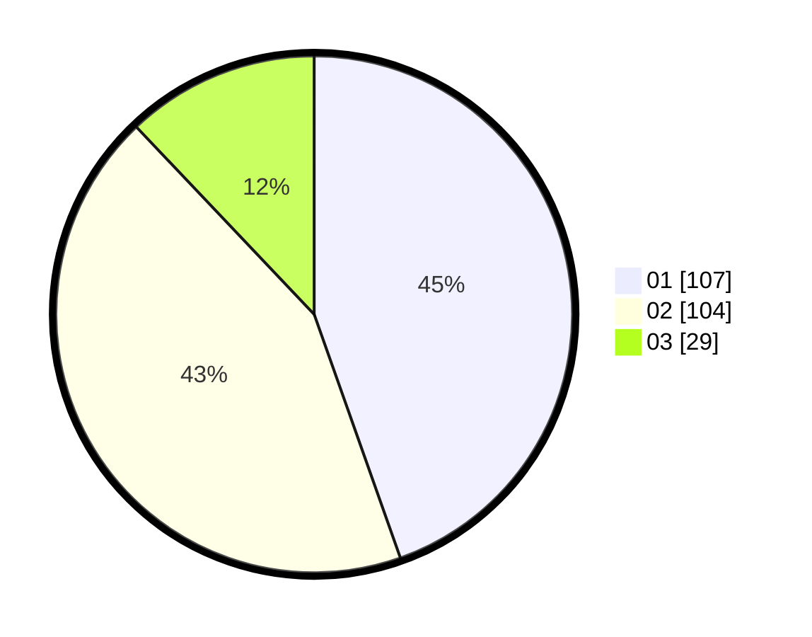

# Hasil

Hasil perolehan suara paslon dapat dilihat pada file paslon-01.txt, paslon-02.txt, dan paslon-03.txt.

Jika tidak ada, artinya data tersebut belum ada pada SIREKAP.

## Perolehan Suara

 * Paslon 01: **107**.
 * Paslon 02: **104**.
 * Paslon 03: **29**.

## Foto C Plano

https://sirekap-obj-formc.kpu.go.id/df48/pemilu/ppwp/31/73/05/10/07/3173051007088-20240216-062724--0fdd682c-4f18-480e-aaec-20368630aac8.jpg

https://sirekap-obj-formc.kpu.go.id/df48/pemilu/ppwp/31/73/05/10/07/3173051007088-20240216-062726--e69ed100-bc86-4623-9333-be23e36bd8d3.jpg

https://sirekap-obj-formc.kpu.go.id/df48/pemilu/ppwp/31/73/05/10/07/3173051007088-20240216-062725--44097393-9a4d-4d4e-9261-9d92eacc4a98.jpg

## DATA PEMILIH TETAP

Jumlah pemilih dalam DPT: **283**.
 * L: **148**.
 * P: **135**.

## DATA PENGGUNA HAK PILIH

Jumlah pengguna hak pilih dalam DPT: **239**.
 * L: **122**.
 * P: **117**.

Jumlah pengguna hak pilih dalam DPTb: **1**.
 * L: **1**.
 * P: **0**.

Jumlah pengguna hak pilih dalam DPK: **1**.
 * L: **1**.
 * P: **0**.

Jumlah pengguna hak pilih: **241**.
 * L: **124**.
 * P: **117**.

## JUMLAH SUARA SAH DAN TIDAK SAH

JUMLAH SELURUH SUARA SAH: **240**.

JUMLAH SUARA TIDAK SAH: **1**.

JUMLAH SELURUH SUARA SAH DAN SUARA TIDAK SAH: **241**.
