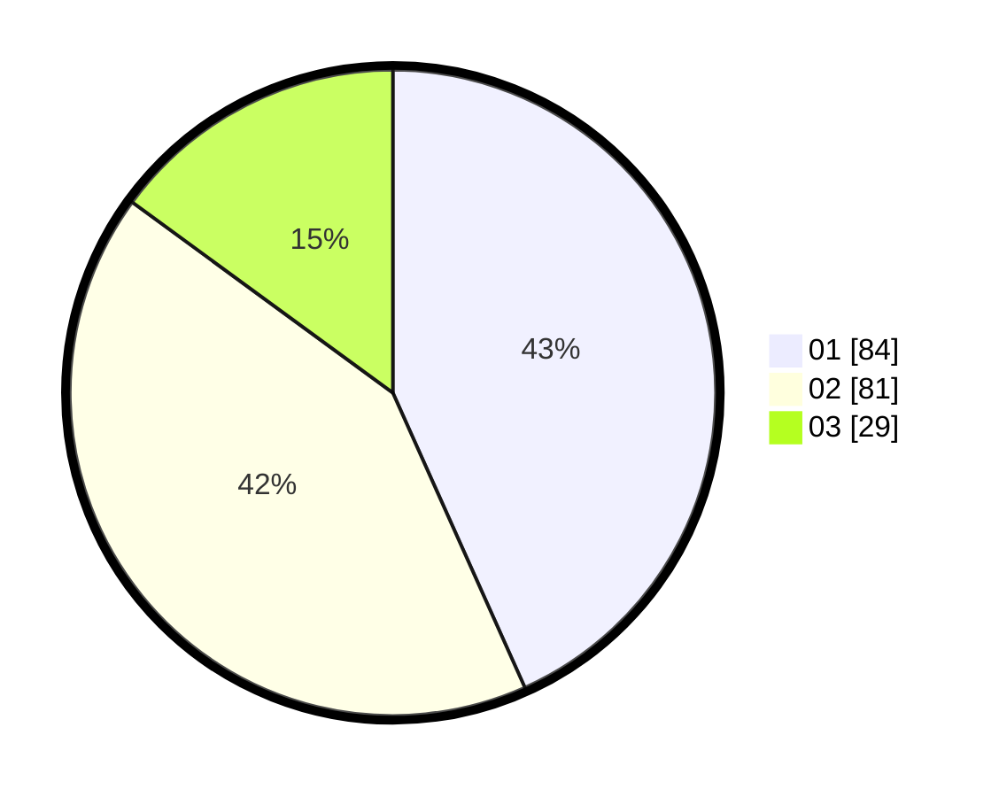

# Hasil

Hasil perolehan suara paslon dapat dilihat pada file paslon-01.txt, paslon-02.txt, dan paslon-03.txt.

Jika tidak ada, artinya data tersebut belum ada pada SIREKAP.

## Perolehan Suara

 * Paslon 01: **84**.
 * Paslon 02: **81**.
 * Paslon 03: **29**.

## Foto C Plano

https://sirekap-obj-formc.kpu.go.id/139e/pemilu/ppwp/31/73/05/10/07/3173051007089-20240216-015755--a97ffb1b-4c12-4f93-96aa-6d140a8c1710.jpg

https://sirekap-obj-formc.kpu.go.id/139e/pemilu/ppwp/31/73/05/10/07/3173051007089-20240214-194115--c4d59a9d-1403-42d7-b5cd-3ceeacb8d5c5.jpg

https://sirekap-obj-formc.kpu.go.id/139e/pemilu/ppwp/31/73/05/10/07/3173051007089-20240216-015756--7b62c257-ceae-4196-80d6-fa0cbf11ac38.jpg

## DATA PEMILIH TETAP

Jumlah pemilih dalam DPT: **241**.
 * L: **115**.
 * P: **126**.

## DATA PENGGUNA HAK PILIH

Jumlah pengguna hak pilih dalam DPT: **188**.
 * L: **84**.
 * P: **104**.

Jumlah pengguna hak pilih dalam DPTb: **5**.
 * L: **5**.
 * P: **0**.

Jumlah pengguna hak pilih dalam DPK: **4**.
 * L: **4**.
 * P: **0**.

Jumlah pengguna hak pilih: **197**.
 * L: **93**.
 * P: **104**.

## JUMLAH SUARA SAH DAN TIDAK SAH

JUMLAH SELURUH SUARA SAH: **194**.

JUMLAH SUARA TIDAK SAH: **3**.

JUMLAH SELURUH SUARA SAH DAN SUARA TIDAK SAH: **197**.
